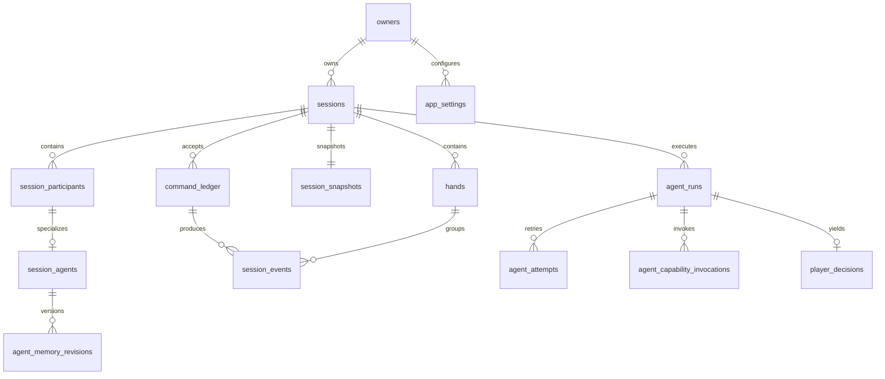

# M2.2 私有 Schema 数据字典

- 适用版本：首发前唯一开发 baseline
- 数据库：Supabase Postgres
- Schema：`app_private`
- 表数量：14
- 事实来源：`apps/server/src/db/schema.ts`、`apps/server/src/db/migrations/0000_baseline.sql`

## 1. 这套 Schema 解决什么问题

M2.2 建立的是服务端私有持久化边界，负责保存：

- 场次归属、场次状态和参赛阵容；
- 手牌结果、命令幂等账本、事件流和权威快照；
- Player/Coach Agent 的运行、尝试、能力调用和 Player 决策审计；
- 不包含秘密的用户设置。

所有表都位于非公开的 `app_private` Schema。浏览器、Supabase Data API、`anon`、`authenticated`、Contracts 和 Agent 领域对象都不能直接访问这些表，只能由后端 Repository 和服务层访问。

## 2. 阅读约定

### 2.1 类型和约束

| 标记 | 含义 |
| --- | --- |
| PK | 主键，用于唯一标识一行 |
| FK | 外键，指向另一张表 |
| UQ | 唯一约束或唯一索引 |
| 非空 | 写入时必须提供，或由数据库默认值生成 |
| 可空 | 在对应业务阶段尚未产生该值时允许为 `NULL` |
| `uuid` | 数据库内部标识符 |
| `timestamptz` | 带时区时间戳 |
| `bigint` | 可增长的序号、版本或计量值；本项目限制在 `0..9007199254740991`，以便安全映射为 JavaScript `number` |
| `jsonb` | 可演进的服务端私有对象载荷 |

所有保留的 `<name>_payload_version` 与 `<name>_payload` 都是一对：

- 版本号描述该 JSON 对象采用的结构契约版本，不是数据库迁移版本；
- 必填载荷的版本号和载荷都非空；
- 可选载荷必须同时为空或同时存在；
- 存在的版本号必须大于 0，载荷必须是 JSON 对象；
- 同一结构版本下只更新业务内容时，不提升版本号；
- 每类持久化 JSON 最多只在数据库行保留这一处载荷版本，JSON 内部不再重复保存信封版本；
- JSONB 不得保存 API Key、数据库连接串、供应商密钥等秘密。

文档中的“默认当前时间”只表示插入时执行 `now()`。`updated_at` 不会由 PostgreSQL 自动随每次更新变化，更新方必须显式维护它。

### 2.2 表关系概览

## 3. 归属、场次和阵容

### 3.1 `owners`

**作用**：把外部稳定身份键映射为数据库内部 Owner UUID，是所有场次和设置的归属根节点。当前迁移固定插入一名 `local-user`，它不是 Supabase Auth 用户表。

**一行代表**：一个业务数据拥有者。

| 字段 | 类型与约束 | 含义 |
| --- | --- | --- |
| `id` | `uuid`，PK | 数据库内部 Owner ID。当前 `local-user` 固定为 `11111111-1111-4111-8111-111111111111`。 |
| `identity_key` | `text`，非空，UQ，非空白 | 对外部身份范围稳定可读的键。当前值为 `local-user`；Repository 后续按它解析内部 UUID。 |
| `created_at` | `timestamptz`，非空，默认当前时间 | Owner 行创建时间。 |

**关键规则**：

- `identity_key` 全局唯一且不能是空字符串或纯空白。
- Owner 删除受 `sessions.owner_id` 限制；存在场次时不能直接删除。

### 3.2 `sessions`

**作用**：保存一场扑克练习会话的生命周期、权威状态版本镜像、事件序号分配位置、当前手牌指针和 Player Agent 协调状态。

**一行代表**：一个 Owner 的一场练习会话。

| 字段 | 类型与约束 | 含义 |
| --- | --- | --- |
| `id` | `uuid`，PK | 场次 ID。 |
| `owner_id` | `uuid`，非空，FK → `owners.id` | 场次归属的 Owner。 |
| `lifecycle_status` | `text`，非空，默认 `active` | 场次生命周期：`active` 进行中；`ended` 正常结束；`readonlyDiagnostic` 只读诊断状态。 |
| `state_version` | `bigint`，非空，默认 `0` | 当前权威私有桌面状态版本镜像；后续必须与 `session_snapshots` 中快照的权威版本一致。 |
| `next_event_seq` | `bigint`，非空，默认 `0` | 下一条场次事件应分配的序号，保证 `session_events` 在场次内严格有序。 |
| `current_hand_id` | `uuid`，可空，FK → 同 Owner、同场次的 `hands` | 当前进行中手牌指针；两手之间或没有当前手牌时为空。 |
| `agent_run_state` | `text`，非空，默认 `idle` | Player Agent 协调状态：`idle` 无运行；`thinking` 正在决策；`paused` 已暂停且无有效活动运行。 |
| `active_player_run_id` | `uuid`，可空，FK → 同场次 `agent_runs.id` | 当前有效 Player Run；仅 `thinking` 时存在。 |
| `active_decision_request_id` | `uuid`，可空 | 当前 Player 决策请求 ID，必须与 `active_player_run_id` 指向的同一 Run 匹配。 |
| `created_at` | `timestamptz`，非空，默认当前时间 | 场次创建时间。 |
| `ended_at` | `timestamptz`，可空 | 场次结束时间；`lifecycle_status = ended` 时必须非空。 |
| `updated_at` | `timestamptz`，非空，默认当前时间 | 场次行最后更新时间，由写入方维护。 |

**关键规则**：

- 每个 Owner 同时最多有一个 `active` 场次。
- `thinking` 时两个活动指针必须同时存在；`idle` 或 `paused` 时必须同时为空。
- 延迟约束在事务提交前保证活动 Player Run 与两个指针完全一致。

### 3.3 `session_participants`

**作用**：统一表示一场中的用户和 AI 参赛者，作为座位、决策和统计等关系的共同外键目标。

**一行代表**：某场次中的一个参赛者席位。

| 字段 | 类型与约束 | 含义 |
| --- | --- | --- |
| `id` | `uuid`，PK | Participant ID；若类型为 `agent`，该 ID 同时也是 Session Agent ID。 |
| `session_id` | `uuid`，非空，FK → `sessions.id` | 参赛者所属场次。删除场次时级联删除。 |
| `owner_id` | `uuid`，非空，复合 FK → `sessions` | 冗余保存归属范围，用于数据库直接阻止跨 Owner 关联。 |
| `participant_type` | `text`，非空 | 参赛者类型：`user` 或 `agent`。 |
| `seat_number` | `integer`，非空 | 物理座位号，范围 `0..8`。用户固定座位 0，AI 只能使用座位 1–8。 |
| `created_at` | `timestamptz`，非空，默认当前时间 | 参赛者加入场次的记录创建时间。 |
| `updated_at` | `timestamptz`，非空，默认当前时间 | 参赛者记录最后更新时间，由写入方维护。 |

**关键规则**：

- `(session_id, seat_number)` 唯一，同一场不能重复占座。
- 一个合法场次必须恰好有 1 名座位 0 的用户和 5–8 名 AI，总人数 6–9。
- 完整阵容由延迟约束在事务提交时统一检查，允许事务内先建 Session、再补齐参赛者和 Agent 子表。

### 3.4 `session_agents`

**作用**：为 `agent` 类型的参赛者保存本场冻结的显示信息、人物配置身份、当前配置载荷和当前记忆。

**一行代表**：一个 AI 参赛者在某场次中的 Agent 实例。

| 字段 | 类型与约束 | 含义 |
| --- | --- | --- |
| `participant_id` | `uuid`，PK，FK → `session_participants.id` | 对应 AI Participant；同时作为 Session Agent ID，不再生成第二套 ID。 |
| `session_id` | `uuid`，非空，复合 FK | Agent 所属场次。 |
| `owner_id` | `uuid`，非空，复合 FK | Agent 所属 Owner，用于排除跨 Owner/场次关系。 |
| `display_name` | `text`，非空，非空白 | 本场对用户展示的 AI 名称快照。 |
| `avatar_color` | `text`，非空，非空白 | 本场对用户展示的头像颜色快照。 |
| `persona_id` | `text`，非空，非空白 | 使用的人物定义 ID。 |
| `persona_version` | `integer`，非空，正整数 | 人物定义版本。相同 `persona_id` 的不同版本不能静默合并统计。 |
| `config_snapshot_key` | `text`，非空，64 位小写十六进制 | 完整规范化、无秘密配置快照的 SHA-256，用于精确区分 Agent 配置。 |
| `current_memory_revision` | `bigint`，非空，默认 `0` | 当前生效的记忆修订号，指向 `agent_memory_revisions` 中同 Agent 的对应修订。 |
| `config_payload_version` | `integer`，非空，正整数 | `config_payload` 的结构契约版本。 |
| `config_payload` | `jsonb` 对象，非空 | 本场冻结的完整 Agent 配置快照，不得包含秘密。 |
| `memory_payload_version` | `integer`，非空，正整数 | 当前 `memory_payload` 的结构契约版本。 |
| `memory_payload` | `jsonb` 对象，非空 | 当前生效的 Agent 记忆内容，是方便读取的当前值镜像。 |
| `created_at` | `timestamptz`，非空，默认当前时间 | Session Agent 创建时间。 |
| `updated_at` | `timestamptz`，非空，默认当前时间 | 配置或当前记忆最后更新时间，由写入方维护。 |

**关键规则**：

- 只有 `participant_type = agent` 的 Participant 才能有此子表行；每个 Agent Participant 必须恰好有一行。
- `current_memory_revision` 通过可延迟外键指向历史修订，便于在同一事务中同时写新修订和切换当前版本。
- 表内不保存当前筹码、按钮或手牌状态，这些属于权威桌面快照。

### 3.5 `agent_memory_revisions`

**作用**：保存 Session Agent 记忆的不可变历史，支持审计某次 Player 决策实际读取了哪一版记忆。

**一行代表**：一个 Session Agent 的一个记忆修订版本。

| 字段 | 类型与约束 | 含义 |
| --- | --- | --- |
| `participant_id` | `uuid`，复合 PK，复合 FK → `session_agents` | 记忆所属 Session Agent。 |
| `session_id` | `uuid`，非空，复合 FK | 所属场次。 |
| `owner_id` | `uuid`，非空，复合 FK | 所属 Owner。 |
| `revision` | `bigint`，复合 PK，非空 | 从 `0` 开始、在单个 Agent 内递增的稳定修订号。 |
| `memory_payload_version` | `integer`，非空，正整数 | 该历史记忆载荷的结构契约版本。 |
| `memory_payload` | `jsonb` 对象，非空 | 该修订冻结的记忆内容。 |
| `created_at` | `timestamptz`，非空，默认当前时间 | 修订创建时间。 |

**关键规则**：

- 主键为 `(participant_id, revision)`，同一 Agent 的同一修订号只能出现一次。
- 删除 Session Agent 时历史修订级联删除。

## 4. 手牌、命令、事件和快照

### 4.1 `hands`

**作用**：保存每手牌的生命周期、开手检查点、正常完成结果或中止原因，以及便于检索的按钮和参与座位。

**一行代表**：某场次中的一手牌。

| 字段 | 类型与约束 | 含义 |
| --- | --- | --- |
| `id` | `uuid`，PK | 手牌 ID。 |
| `session_id` | `uuid`，非空，FK → `sessions.id` | 手牌所属场次。 |
| `owner_id` | `uuid`，非空，复合 FK → `sessions` | 手牌所属 Owner。 |
| `hand_number` | `bigint`，非空 | 该手在场次内的稳定序号；与 `session_id` 组合唯一。 |
| `status` | `text`，非空 | 手牌状态：`inProgress`、`completed` 或 `aborted`。 |
| `hand_start_checkpoint_payload_version` | `integer`，非空，正整数 | 开手检查点载荷的结构契约版本。 |
| `hand_start_checkpoint_payload` | `jsonb` 对象，非空 | 发底牌开始时冻结的私有开手检查点，用于恢复和审计。 |
| `completed_result_payload_version` | `integer`，可空，正整数 | 正常完成结果载荷版本；仅 `completed` 时存在。 |
| `completed_result_payload` | `jsonb` 对象，可空 | 正常完成手的完整私有结算结果；中止手牌不伪造该结果。 |
| `abort_reason` | `text`，可空，非空白 | 手牌中止原因；仅 `aborted` 时必填。 |
| `aborted_by_agent_run_id` | `uuid`，可空 | 若中止由 Agent Run 引起，记录该 Run ID；M2.2 不为此列建立外键，以避免循环生命周期耦合。 |
| `button_seat` | `integer`，非空，`0..8` | 该手庄家按钮所在物理座位。 |
| `participant_seats` | `integer[]`，非空 | 该手实际参与座位，必须包含座位 0、数量 6–9、值域 0–8 且不能重复。 |
| `started_at` | `timestamptz`，非空 | 开手时间。 |
| `completed_at` | `timestamptz`，可空 | 正常结算完成时间；仅 `completed` 时存在。 |
| `aborted_at` | `timestamptz`，可空 | 中止时间；仅 `aborted` 时存在。 |
| `updated_at` | `timestamptz`，非空，默认当前时间 | 手牌行最后更新时间，由写入方维护。 |

**关键规则**：

- `(session_id, hand_number)` 唯一；每场同时最多一手 `inProgress`。
- 三种状态与结果、中止字段严格对应：进行中无终态数据；完成必须有结果；中止必须有原因和时间。
- 权威动作时间线在 `session_events`，不另建 Street、Betting Round、Showdown 或 Hand Action 表。

### 4.2 `command_ledger`

**作用**：记录会话命令的幂等处理过程、输入摘要、最终状态版本、产生的事件范围和原始响应。

**一行代表**：某场次接收的一条唯一命令。

| 字段 | 类型与约束 | 含义 |
| --- | --- | --- |
| `id` | `uuid`，PK | 命令账本内部行 ID，供事件和 Player Decision 关联。 |
| `session_id` | `uuid`，非空，FK → `sessions.id` | 命令所属场次。 |
| `owner_id` | `uuid`，非空，复合 FK → `sessions` | 命令所属 Owner。 |
| `command_id` | `uuid`，非空 | 客户端或上游生成的幂等命令 ID；在同一场次内唯一。 |
| `canonical_payload_digest` | `text`，非空，64 位小写十六进制 | 规范化命令负载的 SHA-256，用于识别同一 `command_id` 是否被错误地复用于不同内容。 |
| `processing_status` | `text`，非空 | 处理状态：`processing`、`completed` 或 `failed`。 |
| `final_state_version` | `bigint`，可空 | 命令结束后权威状态版本；尚未得出终态时为空。 |
| `first_event_seq` | `bigint`，可空 | 该命令产生的第一条场次事件序号。 |
| `last_event_seq` | `bigint`，可空 | 该命令产生的最后一条场次事件序号；必须不小于 `first_event_seq`。 |
| `response_payload_version` | `integer`，可空，正整数 | 原始响应载荷的结构契约版本。 |
| `response_payload` | `jsonb` 对象，可空 | 首次处理生成的原始响应，重复命令可据此返回相同结果。 |
| `created_at` | `timestamptz`，非空，默认当前时间 | 命令首次登记时间。 |
| `completed_at` | `timestamptz`，可空 | 命令完成或失败的终态时间。 |
| `updated_at` | `timestamptz`，非空，默认当前时间 | 命令账本最后更新时间，由写入方维护。 |

**关键规则**：

- `(session_id, command_id)` 是后续 UPSERT 的幂等边界。
- 事件范围必须两个字段同时为空或同时存在。

### 4.3 `session_events`

**作用**：保存场次内不可变、有序的权威事件；同时冻结服务端私有事件和可对外发布的 SSE 事件载荷。

**一行代表**：场次事件流中的一条事件。

| 字段 | 类型与约束 | 含义 |
| --- | --- | --- |
| `id` | `uuid`，PK | 事件行 ID。 |
| `session_id` | `uuid`，非空，FK → `sessions.id` | 事件所属场次。 |
| `owner_id` | `uuid`，非空，复合 FK → `sessions` | 事件所属 Owner。 |
| `hand_id` | `uuid`，可空，复合 FK → `hands` | 若事件属于某手牌，记录该 Hand；场次级事件可为空。 |
| `command_ledger_id` | `uuid`，可空，复合 FK → `command_ledger` | 产生该事件的命令账本行；非命令来源事件可为空。 |
| `event_seq` | `bigint`，非空 | 场次内单调分配的事件序号；与 `session_id` 组合唯一。 |
| `state_version_before` | `bigint`，非空 | 应用该事件前的权威状态版本。 |
| `state_version_after` | `bigint`，非空 | 应用该事件后的权威状态版本。一个命令可产生多条共享同一前后版本边界的事件。 |
| `private_event_payload_version` | `integer`，非空，正整数 | 私有事件载荷结构版本。 |
| `private_event_payload` | `jsonb` 对象，非空 | 只供服务端重放、审计或派生使用的完整私有事件。 |
| `public_event_payload` | `jsonb` 对象，非空 | 已做可见性投影、可以通过 SSE 对外发送的事件载荷。 |
| `created_at` | `timestamptz`，非空，默认当前时间 | 事件持久化时间。 |

**关键规则**：

- `(session_id, event_seq)` 唯一。
- `hand_id` 和 `command_ledger_id` 的复合外键都同时校验 Session 与 Owner，不能跨场关联。

### 4.4 `session_snapshots`

**作用**：保存每场唯一的最新权威 `PrivateTableState` 快照，供快速读取和恢复；历史事实仍以事件及手牌结果为准。

**一行代表**：某场次当前唯一快照。

| 字段 | 类型与约束 | 含义 |
| --- | --- | --- |
| `session_id` | `uuid`，PK，FK → `sessions.id` | 场次 ID；同时作为主键，因此每场最多一份当前快照。 |
| `owner_id` | `uuid`，非空，复合 FK → `sessions` | 快照所属 Owner。 |
| `private_table_state_payload_version` | `integer`，非空，正整数 | 私有桌面状态 JSON 的唯一行载荷版本。 |
| `private_table_state_payload` | `jsonb` 对象，非空 | 当前完整私有桌面状态，包含不能暴露给浏览器的牌局信息。 |
| `updated_at` | `timestamptz`，非空，默认当前时间 | 快照最后写入时间，由写入方维护。 |

**关键规则**：

- 删除 Session 时快照级联删除。
- `sessions.state_version` 是快照内部权威版本的结构化镜像；一致性由后续 Repository/事务层维护。

## 5. Agent 运行与审计

### 5.1 `agent_runs`

**作用**：统一记录 Player 和 Coach 两种 Runtime 的一次受限执行，负责幂等、租约、并发围栏、截止时间、恢复检查点和最终结果。

**一行代表**：一次 Player 决策运行或一次 Coach 手牌复盘运行。

| 字段 | 类型与约束 | 含义 |
| --- | --- | --- |
| `id` | `uuid`，PK | Agent Run ID。 |
| `owner_id` | `uuid`，非空，复合 FK | Run 所属 Owner。 |
| `session_id` | `uuid`，非空，FK → `sessions.id` | Run 所属场次。 |
| `runtime` | `text`，非空 | Runtime 类型：`player` 或 `coach`。 |
| `trigger_type` | `text`，非空 | 启动原因/入口类型，例如自动决策、人工请求或恢复；具体值由 Runtime 契约定义。 |
| `lifecycle` | `text`，非空 | 生命周期：`queued`、`leased`、`running`、`completed`、`failed`、`cancelled`、`stale`。 |
| `idempotency_key` | `text`，非空，非空白 | Runtime 范围内的幂等键；`(session_id, runtime, idempotency_key)` 唯一。 |
| `hand_id` | `uuid`，非空，复合 FK → `hands` | Run 处理的手牌；当前 Player 和 Coach 都必须关联一手。 |
| `participant_id` | `uuid`，可空，复合 FK → `session_agents` | Player Run 的行动 AI；Coach Run 必须为空。 |
| `source_state_version` | `bigint`，可空 | Player Run 发起决策时读取的权威状态版本；Coach Run 必须为空。 |
| `decision_request_id` | `uuid`，可空 | Player 决策请求 ID，在场次历史内永久唯一；Coach Run 必须为空。 |
| `parent_run_id` | `uuid`，可空 | 逻辑父 Run ID，用于记录重试、恢复或派生关系；当前未设置外键。 |
| `replacement_run_id` | `uuid`，可空 | 替代当前 Run 的新 Run ID，用于审计接替链；当前未设置外键。 |
| `lease_owner` | `text`，可空，非空白 | 当前持有执行租约的 Worker 标识。 |
| `lease_expires_at` | `timestamptz`，可空 | 租约到期时间；必须与 `lease_owner` 同时为空或同时存在。 |
| `fencing_token` | `bigint`，非空，默认 `0` | 单调并发围栏令牌，阻止过期 Worker 提交结果。 |
| `deadline_at` | `timestamptz`，非空 | 本次 Run 的业务执行截止时间。 |
| `runtime_definition_version` | `integer`，非空，正整数 | 执行该 Run 的 Runtime 编排/定义版本。 |
| `termination_reason` | `text`，可空 | Run 终止、失败、取消或过期的可审计原因。 |
| `run_config_payload_version` | `integer`，非空，正整数 | 运行配置载荷版本。 |
| `run_config_payload` | `jsonb` 对象，非空 | 本次运行冻结的配置，不包含秘密。 |
| `budget_payload_version` | `integer`，非空，正整数 | 预算载荷版本。 |
| `budget_payload` | `jsonb` 对象，非空 | 本次运行的 token、成本、时间或能力调用预算。 |
| `checkpoint_payload_version` | `integer`，可空，正整数 | 可恢复检查点载荷版本。 |
| `checkpoint_payload` | `jsonb` 对象，可空 | 执行过程中的恢复检查点；尚未生成时为空。 |
| `result_payload_version` | `integer`，可空，正整数 | 最终结果载荷版本。 |
| `result_payload` | `jsonb` 对象，可空 | Run 的最终结果或终态摘要；尚未结束或无结果时为空。 |
| `created_at` | `timestamptz`，非空，默认当前时间 | Run 创建时间。 |
| `started_at` | `timestamptz`，可空 | Worker 实际开始执行时间。 |
| `completed_at` | `timestamptz`，可空 | Run 进入终态的时间。 |
| `updated_at` | `timestamptz`，非空，默认当前时间 | Run 最后更新时间，由写入方维护。 |

**关键规则**：

- Player Run 必须同时具有 `participant_id`、`source_state_version`、`decision_request_id`；Coach Run 三者必须全为空。
- 同一场次、来源状态版本和 AI 同时最多有一条 `queued|leased|running` 的 Player Run。
- 活动 Player Run 必须与 `sessions` 的协调指针一致，提交时由延迟约束检查。
- Coach Run 只能关联同 Owner、同场次的 `completed` Hand。

### 5.2 `agent_attempts`

**作用**：记录一次 Agent Run 内每次模型调用尝试，包括路由、模型、token、成本、耗时、错误和是否被采用。

**一行代表**：某个 Agent Run 的一次稳定编号尝试。

| 字段 | 类型与约束 | 含义 |
| --- | --- | --- |
| `id` | `uuid`，PK | 尝试 ID。 |
| `agent_run_id` | `uuid`，非空，复合 FK → `agent_runs` | 所属 Agent Run。 |
| `owner_id` | `uuid`，非空，复合 FK | 所属 Owner。 |
| `session_id` | `uuid`，非空，复合 FK | 所属场次。 |
| `attempt_number` | `integer`，非空，`>= 0` | Run 内稳定尝试序号；与 `agent_run_id` 组合唯一。 |
| `stage` | `text`，非空 | 尝试发生的 Runtime 阶段，由具体 Runtime 定义。 |
| `lifecycle` | `text`，非空 | 尝试状态：`started`、`completed`、`failed`、`cancelled` 或 `stale`。 |
| `accepted` | `boolean`，非空，默认 `false` | 此尝试的输出是否最终被 Runtime 采用。 |
| `stale` | `boolean`，非空，默认 `false` | 此尝试是否因权威状态或租约已过期而失效。 |
| `interrupted` | `boolean`，非空，默认 `false` | 此尝试是否被取消信号、超时或进程中断。 |
| `provider` | `text`，非空 | 模型供应商标识。 |
| `model` | `text`，非空 | 实际调用的模型标识。 |
| `attempt_type` | `text`，非空 | 尝试类型，例如主调用、降级或重试；具体值由 Runtime 定义。 |
| `routing_reason` | `text`，可空 | 选择该 Provider/模型/尝试类型的原因。 |
| `input_tokens` | `bigint`，非空，默认 `0` | 本次尝试输入 token 数。 |
| `output_tokens` | `bigint`，非空，默认 `0` | 本次尝试输出 token 数。 |
| `cost_microunits` | `bigint`，非空，默认 `0` | 以微单位记录的成本，避免浮点金额误差；具体币种/换算由上层契约定义。 |
| `duration_ms` | `bigint`，可空 | 尝试总耗时，单位毫秒。 |
| `error_category` | `text`，可空 | 脱敏后的错误分类，不保存敏感原始错误内容。 |
| `attempt_payload_version` | `integer`，可空，正整数 | 尝试详情载荷版本。 |
| `attempt_payload` | `jsonb` 对象，可空 | 脱敏后的输入/输出和校验详情；不得保存 `reasoning_content`。 |
| `started_at` | `timestamptz`，非空 | 尝试开始时间。 |
| `completed_at` | `timestamptz`，可空 | 尝试结束时间。 |
| `created_at` | `timestamptz`，非空，默认当前时间 | 审计行创建时间。 |

### 5.3 `agent_capability_invocations`

**作用**：审计 Agent Run 内由确定性 Runtime 编排的能力调用，记录授权判断、输入输出 Schema、内容哈希、预算消耗和错误。

**一行代表**：某个 Agent Run 的一次受限能力调用。

| 字段 | 类型与约束 | 含义 |
| --- | --- | --- |
| `id` | `uuid`，PK | 能力调用 ID。 |
| `agent_run_id` | `uuid`，非空，复合 FK → `agent_runs` | 所属 Agent Run。 |
| `owner_id` | `uuid`，非空，复合 FK | 所属 Owner。 |
| `session_id` | `uuid`，非空，复合 FK | 所属场次。 |
| `invocation_number` | `integer`，非空，`>= 0` | Run 内稳定调用序号；与 `agent_run_id` 组合唯一。 |
| `capability_name` | `text`，非空 | 被调用的能力名称。 |
| `capability_version` | `integer`，非空，正整数 | 能力实现/契约版本。 |
| `authorized` | `boolean`，非空 | 调用是否通过能力授权检查。 |
| `input_schema_version` | `integer`，非空，正整数 | 输入对象使用的 Schema 版本。 |
| `input_hash` | `text`，非空，64 位小写十六进制 | 规范化输入的 SHA-256，用于审计和重复检测。 |
| `output_schema_version` | `integer`，可空，正整数 | 输出对象 Schema 版本；无输出时为空。 |
| `output_hash` | `text`，可空，64 位小写十六进制 | 规范化输出的 SHA-256；必须与输出版本同时存在。 |
| `budget_cost` | `bigint`，非空，默认 `0` | 此调用消耗的抽象预算单位。 |
| `duration_ms` | `bigint`，可空 | 调用耗时，单位毫秒。 |
| `error_category` | `text`，可空 | 脱敏后的错误分类。 |
| `invocation_payload_version` | `integer`，可空，正整数 | 调用详情载荷版本。 |
| `invocation_payload` | `jsonb` 对象，可空 | 脱敏后的输入、输出和授权/校验详情。 |
| `started_at` | `timestamptz`，非空 | 调用开始时间。 |
| `completed_at` | `timestamptz`，可空 | 调用结束时间。 |
| `created_at` | `timestamptz`，非空，默认当前时间 | 审计行创建时间。 |

## 6. Player 决策与 Coach 复盘

### 6.1 `player_decisions`

**作用**：冻结 Player Run 产生的一份决策，记录决策点身份、使用的记忆版本、候选集、Validator 结果和最终提交状态。

**一行代表**：一个 Player Agent Run 的唯一决策产物。

| 字段 | 类型与约束 | 含义 |
| --- | --- | --- |
| `id` | `uuid`，PK | Player Decision ID。 |
| `agent_run_id` | `uuid`，非空，UQ，复合 FK → `agent_runs` | 产生该决策的 Player Run；一条 Run 至多一份决策。 |
| `owner_id` | `uuid`，非空，复合 FK | 所属 Owner。 |
| `session_id` | `uuid`，非空，复合 FK | 所属场次。 |
| `hand_id` | `uuid`，非空，复合 FK | 决策发生的手牌。 |
| `participant_id` | `uuid`，非空，复合 FK → `session_agents` | 做出决策的 AI Participant/Session Agent。 |
| `source_state_version` | `bigint`，非空 | 决策所依据的权威状态版本，必须与 Run 完全一致。 |
| `decision_request_id` | `uuid`，非空 | 决策请求 ID，必须与 Run 完全一致。 |
| `memory_revision` | `bigint`，非空，复合 FK → `agent_memory_revisions` | 做决策时实际读取的 Agent 记忆修订号。 |
| `runtime` | `text`，非空，默认 `player`，固定值 | 复合外键中的类型判别列，确保只能关联 Player Run。 |
| `submission_status` | `text`，非空 | 提交状态：`pending`、`committed`、`rejected` 或 `stale`。 |
| `command_ledger_id` | `uuid`，可空，复合 FK → `command_ledger` | 若决策已转成扑克命令，记录对应命令账本行。 |
| `decision_packet_payload_version` | `integer`，非空，正整数 | 决策包载荷版本。 |
| `decision_packet_payload` | `jsonb` 对象，非空 | 冻结的决策输入、可见上下文和模型选择等决策包。 |
| `candidate_set_payload_version` | `integer`，非空，正整数 | 候选集合载荷版本。 |
| `candidate_set_payload` | `jsonb` 对象，非空 | Runtime 生成并允许模型选择的有界候选动作集合。 |
| `validator_result_payload_version` | `integer`，非空，正整数 | Validator 结果载荷版本。 |
| `validator_result_payload` | `jsonb` 对象，非空 | 对候选/最终决策进行合法性和提交前验证的冻结结果。 |
| `created_at` | `timestamptz`，非空，默认当前时间 | 决策产物创建时间。 |
| `submitted_at` | `timestamptz`，可空 | 决策实际提交到扑克命令事务的时间。 |

**关键规则**：

- 复合外键一次性保证 Run、Owner、Session、Hand、Agent、来源版本、请求 ID 和 Runtime 全部一致。
- `command_ledger_id` 为空不代表失败，也可能是尚未提交、已拒绝或已过期。

## 7. 应用设置

### 7.1 `app_settings`

**作用**：保存某个 Owner 的非秘密、稳定键名应用设置。

**一行代表**：某个 Owner 的一个设置项。

| 字段 | 类型与约束 | 含义 |
| --- | --- | --- |
| `id` | `uuid`，PK | 设置行 ID。 |
| `owner_id` | `uuid`，非空，FK → `owners.id` | 设置所属 Owner；删除 Owner 时级联删除。 |
| `setting_key` | `text`，非空，非空白 | 稳定设置键，例如某类 Provider 的非秘密偏好；具体键由设置契约定义。 |
| `setting_payload` | `jsonb` 对象，非空 | 设置内容，只能保存非秘密配置。 |
| `updated_at` | `timestamptz`，非空，默认当前时间 | 设置最后更新时间，由写入方维护。 |

**关键规则**：

- `(owner_id, setting_key)` 唯一。
- 不得保存 Provider Key、模型密钥、数据库 URL 或原始连接配置。

## 8. 三组跨行延迟约束

普通外键、唯一索引和单行检查不能表达全部业务不变量，因此 M2.2 只引入三组窄范围、事务提交时执行的延迟约束：

| 约束组 | 涉及表 | 提交前保证 |
| --- | --- | --- |
| 阵容完整性 | `sessions`、`session_participants`、`session_agents` | 每场恰好 1 名座位 0 用户、5–8 名 AI、总人数 6–9；用户无 Agent 子行，AI 恰好有一行 Agent 子行。 |
| Player 活动协调 | `sessions`、`agent_runs` | `thinking` 时恰好一条有效 Player Run 且与 Session 双指针一致；`idle/paused` 时没有有效 Player Run。 |
| Coach 手牌资格 | `hands`、`agent_runs` | Coach Run 只能绑定同范围的已完成 Hand，存在 Coach Run 时不能把 Hand 改成进行中或中止。 |

这些约束是延迟到事务提交时检查的，因此创建完整业务图时可以在同一事务内按自然顺序插入多张表，只要最终提交状态满足不变量。

## 9. 明确没有建的表

为了避免把当前产品需求扩展成通用 Agent 平台或重复存储扑克事实，M2.2 明确没有建立：

- `agent_templates`、`agent_personas`；
- 通用 Agent 定义、步骤、产物或多 Agent 编排表；
- 旧的 `hand_events`；
- `streets`、`betting_rounds`、`showdowns`、`hand_actions` 等扑克投影表；
- 尚无当前数据消费者的 `coach_reviews`、`coach_decision_assessments`、`hand_statistics_shards`、`session_settlement_statistics_shards`；
- 跨 Owner 全局统计或任意筛选结果缓存；
- Supabase Auth、Realtime、Storage、Edge Functions 相关表。

权威动作时间线统一来自 `session_events`，完整正常结算结果来自 `hands.completed_result_payload`，当前私有状态来自 `session_snapshots.private_table_state_payload`。
