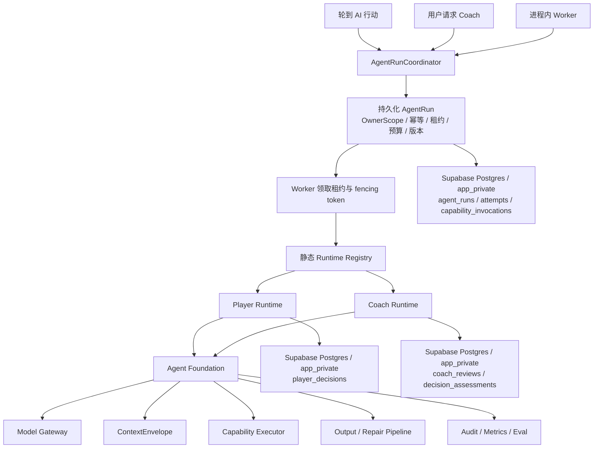
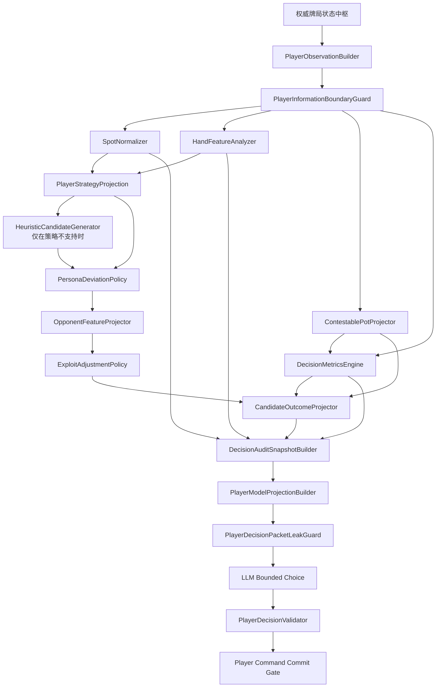
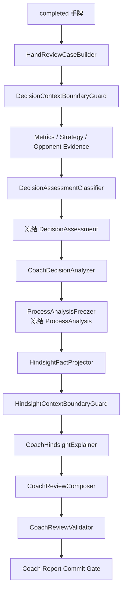

# Agent Foundation 与受限 Runtime 总体架构

- 状态：已确认
- 日期：2026-07-26
- 最后更新：2026-08-16
- 上位文档：[产品需求文档](./2026-07-23-poker-practice-prd.md)
- Player 专项设计：[Player Agent Runtime](./2026-07-23-poker-practice-agent-harness-design.md)
- Coach 专项设计：[Coach Agent](./2026-07-26-poker-coach-agent-design.md)
- 后端边界：[后端、牌局引擎与数据设计](./2026-07-23-poker-practice-backend-design.md)
- 数据库边界：[Supabase Postgres 与 Drizzle 迁移设计](./2026-07-29-supabase-postgres-drizzle-migration-design.md)
- 专项开发任务：[Agent 大模块开发任务](../plans/2026-07-26-agent-module-development-tasks.md)

## 1. 目标

本文定义 Player Agent 与 Coach Agent 共同依赖的运行基础，以及两种 Runtime 必须保持隔离的业务边界。

本项目不以“具备最多 Agent 功能”为成熟标准。成熟度由以下能力衡量：

- 目标、信息、权限和副作用边界可证明。
- 运行可恢复、可审计、可限额。
- 模型不负责可由程序可靠完成的数学、牌力/听牌结构、范围查询和样本判断。
- Prompt、模型、策略数据和分类规则升级可回归。
- 首版模块化单体不提前引入分布式调度基础设施，但保留未来多租户上线所需的窄适配边界。

采用的路线是：

> 共享 Agent Foundation + 静态 Runtime Registry + Player/Coach 两种受限 Runtime。

Foundation 只提供通用运行机制，不理解扑克目标。Runtime 拥有完整业务状态机、私有上下文、能力清单、预算、路由、校验和 Commit Gate。

Player 与 Coach 共同采用“确定性核心 + 概率性边缘”：凡是与当前决策相关、具有明确规则且可重复测试的事实或约束，必须在模型调用前由程序计算、查询或分类；LLM 只接收经过信息边界处理的派生事实和受限候选，负责多个合理候选之间的角色化选择或教学表达。不能可靠定义的 clean outs、对手范围条件权益或精确 EV 必须显式标记不可用，不能转交模型猜测。该原则不要求穷举无关特征，也不允许预处理服务在存在真实选择空间时静默提交最终动作。程序输出“可复现”不等于它就是客观真理：规则、公式、数据集、统计、启发式和模型文本必须分别标注证据性质。

Player 与 Coach 都服务于本项目的 6–9 人无限注德州扑克规则。翻前策略按 `tableSize + logicalPosition + actionNode` 建立更陡的位置梯度；翻后计算与匹配代码在 6–9 人间复用，但仍携带翻前范围、位置、行动线和实际入池人数，不能假设结果必然相同。

### 1.1 客观事实前置规则

“尽量处理所有已知客观事实”限定为：对当前决策有用、能从允许信息中可靠导出、具有稳定语义并可版本化回放的事实。Runtime 不把完整内部状态或无关历史全部塞给模型，而是先形成完整的确定性分析结果，再由决策包投影仅选择本次需要的字段。

模型调用前至少处理以下类别：

1. **规则与状态事实**：固定规则集版本、街次、行动者、按钮、名义/实际盲注投入、短盲 all-in、大盲行动权、合法动作、最小/最大目标金额、最后一次足额加注、是否重新开放加注、主池/边池资格、有效请求和权威状态版本。
2. **标准化局面与响应拓扑**：桌型、逻辑位置、存活及入池人数、待行动人数、每名对手与 Hero 的位置关系、行动顺序、Hero 后方玩家、翻前/当前街主动玩家、规范行动线、谁可能响应每个候选、谁仍可加注、Hero 是否还可能再次面对行动，以及 Hero 当前行动完成与本轮下注立即关闭两个不同事实。
3. **原子可见牌事实**：翻前的对子/同花、点数间隔、连张、Broadway、A-wheel 潜力；翻后的最佳五张牌、稳定比较元组、底牌使用数、对子关系、踢脚、超牌数、同花与顺子高张、听牌/后门听牌、重叠改善组；牌面的花色结构、配对结构、顺子窗口、点数连接度，以及新街带来的可证明变化。
4. **可争夺底池与当前数学**：按对手有效筹码、主池/边池及资格拆分 Hero 当前真正可争夺的金额，再计算跟注成本、底池赔率、翻后 SPR、合法下注/加注边界和统一精度下的尺度比例；不能用总底池替代 Hero 的可争夺底池。
5. **候选结果事实**：每个候选的跟注额、本次新增投入、本街行动后总投入、本手累计投入、必然返还的未跟注超额、真正风险金额、执行后的可争夺底池、剩余筹码、逐对手有效筹码、预计下一街 SPR（若有下一街）、是否强制 runout、剩余发牌街数、是否强制摊牌、响应者集合、后续可加注者、Hero 是否还会面对行动、本轮是否立即关闭及合法后继空间；只在响应假设明确时输出盈亏平衡阈值。
6. **策略事实**：策略数据集、版本、完整 spot 键、匹配等级、场景假设、基准候选与参考动作执行频率；下注尺度与执行频率使用不同字段。
7. **人物与对手派生事实**：人物政策对候选权重的有界确定性调整，以及截止当前事件的公开样本、样本门槛、置信度和剥削偏离上限。
8. **Coach 评价证据**：决策时点重建、基准支持情况、数学偏差和证据充分性；只有证据等级允许时才形成行为偏差标签、质量评价、严重度或 EV 损失，并在教学模型调用前冻结。

每项派生事实必须携带或可追溯到 `sourceRef`、`asOfEventSeq/stateVersion`、Schema/算法/数据版本、适用假设、`available | unavailable | notApplicable` 状态，以及 `epistemicKind: ruleFact | formulaFact | datasetBaseline | statisticalEvidence | heuristicJudgment | modelGeneratedText`。`unavailable` 表示当前缺少可靠输入或版本化算法，`notApplicable` 表示概念不适用于该节点；两者不能用 `null` 混为一谈，也不能要求 LLM 补算。

`wet/dry`、`blank/scareCard`、`capped/uncapped`、`value/bluff/protection`、`bluffCatcher` 等词不能直接作为无条件客观事实。首版优先保存上述原子结构；确需使用语义标签时，必须由版本化规则或明确范围假设映射，并标记为 `heuristicJudgment` 或相应数据证据。情绪、恐惧、tilt、动机和“为何如此行动”不能由牌谱直接证明，只能作为带证据限制的教学假设，不能写入客观事实或自动画像。

以下值在首版没有显式、版本化范围、响应模型或 Solver 时不得生成：clean outs、范围条件权益/胜率/EV、domination 概率、fold equity、对手 call/raise 概率、隐含赔率/反向隐含赔率单值、多街反事实收益，以及仅由 SPR 推导的唯一动作。可以确定性枚举结构性改善牌或合法的对手胜/平组合，但必须明确它们分别不等于 clean outs、对手范围或概率。

Player LLM 的剩余职责只有：在程序生成且验证过的多个候选之间，结合已冻结人物形象选择一个 `candidateActionId`，并可生成简短说明。Coach LLM 的剩余职责只有：把已冻结的过程评价和事后事实组织成可理解、可迁移的教学解释。两者都不得新增、覆盖或重新解释客观事实。

## 2. 能力取舍

| 通用 Agent 能力 | 本项目决策 |
| --- | --- |
| Agent Loop | 不提供通用自主循环；Player 和 Coach 使用各自的确定性状态机 |
| Tool System | Foundation 提供能力注册、授权、Schema、超时和审计；调用计划由 Runtime 固定 |
| Context Engineering | Runtime 私有 Builder 负责数据和白名单；Foundation 只机械处理已构建的 `ContextEnvelope` |
| Memory | 使用强类型、明确作用域的 Runtime 存储，不建立统一自动召回层 |
| RAG | 当前无需求，不实现向量数据库或非结构化召回 |
| Skills | 使用静态、版本化 `PromptModule`，不使用动态 Skill 安装 |
| Plugins | 不实现运行时插件；供应商和数据源通过代码发布的内部适配器扩展 |
| Channel | 使用类型化事件和结果端口，不提供 Agent 自由消息总线 |
| 权限 | `OwnerScope` 数据权限 + `CapabilityManifest` Agent 能力权限，默认拒绝 |
| Cron | Agent 不拥有 Cron；只提供受控异步 Job，未来 Scheduler 也只能创建固定 Job |
| Multi-Agent | 多个隔离 Agent 实例由确定性编排器唤醒，不允许互相通信、委派或协商 |

当前实现明确不包含：

- 动态 Runtime、Skill 或 Plugin SDK。
- 通用 RAG、长期用户画像和情绪识别。
- Agent 自主 Cron。
- Agent 间消息、委派和协作式 Multi-Agent。
- 用户可覆盖协议的自由 Prompt。
- Redis、云消息队列、真实认证和 OpenTelemetry 平台。
- `supabase-js`、Supabase Auth、Realtime、Storage 和 Edge Functions；Supabase 只托管 Agent 与牌局共享的 PostgreSQL。

### 2.1 Coach 长期记忆的后置边界

长期漏洞聚合和用户画像属于强类型、明确作用域的 Coach 长期记忆，不属于 Foundation 通用自动召回，也不需要 RAG。其固定依赖方向为：

```text
不可变 DecisionAssessment
  → 版本化错误/牌面 taxonomy
  → 确定性 LeakAggregationService
  → 日/周/月 LeakTrendSnapshot + 有时效的 CoachProfileSnapshot
  → 有界 TeachingFocusProjection
  → 有界 CoachMemoryProjection
  → Coach LLM
```

Foundation 未来最多提供版本化载荷、OwnerScope、保留/删除和 Context 大小门禁，不理解扑克错误类型，也不聚合 EV。Coach Runtime 拥有 taxonomy、聚合、画像投影和只读 Context Builder。LLM 只消费投影，不直接读取全量历史，不写回 assessment、聚合或画像。

必须区分三类信息：不可覆盖的逐决策事实、可从事实重建的聚合统计、带窗口与证据的阶段性画像。出现频率、累计 EV 和高严重度但 EV 不可用的偏差分别排名；没有可比较 EV 时不能产生“最贵漏洞”。错误率以可评价决策机会为分母并单独报告覆盖率，用户默认只接收一个当前重点和最多两个观察项。首版继续延期该能力，完整契约见 Coach 专项设计第 15 节。

针对漏洞创建训练牌局、管理练习 Session、评分、复测并改变改善状态属于更后的 M11/A11，不是 Foundation Memory，也不是 M10/A10 画像投影的隐式副作用。Foundation 只为这些后置业务提供相同的 OwnerScope、版本化载荷、生命周期和保留删除机制。

## 3. 总体架构



依赖方向：

- Foundation 不依赖 Player、Coach、牌局引擎、策略数据或数据库业务模型。
- Player 和 Coach 依赖 Foundation 端口，Foundation 不能反向控制 Runtime。
- API、Session Coordinator 和 Worker 只调用 Runtime 应用入口，不直接拼 Prompt。
- Player 与 Coach 不共享 Context Schema、Prompt、记忆、业务 Validator 或 Commit Gate。
- 策略事实源可以共享，Player 与 Coach 使用不同投影。
- Hono 是浏览器可访问的唯一服务入口；Agent、会话和 Coach 只能通过应用服务与窄 Repository 端口访问 PostgreSQL，不能绕过所有权、生命周期或公开投影边界。

### 3.1 上线部署拓扑目标

当前仓库仍按本机产品运行：Hono 硬编码监听回环地址，并执行本机 Host/Origin 白名单。未来把产品上线时，目标部署由两个独立运行边界组成：

```text
常驻 Node.js/Hono 服务
├── HTTP API 与 SSE
├── Session / AgentRun Coordinator
├── 进程内 Player Worker（保留一个槽位）
├── 进程内 Coach Worker（保留一个槽位）
└── Player / Coach Runtime
          │
          ├── 模型供应商 API
          └── Supabase transaction pooler
                         │
                         ▼
             Supabase 托管 PostgreSQL
             └── app_private
```

- 上线前需要把监听地址、Host/Origin、传输安全和真实身份边界按独立设计开放；不能仅把当前镜像放到公网。
- Hono 服务需要常驻进程语义，以承载 SSE、进程内 Worker、优雅关闭和运行中请求管理；不把完整 Agent 执行塞进一次长 HTTP 请求。
- Supabase PostgreSQL 是容器外部的唯一运行数据事实源。容器不携带数据库文件，不挂载数据库持久卷，也不维护本地数据库副本。
- API 先持久化 `AgentRun` 再返回运行标识；Worker 随后领取租约并异步执行。HTTP 请求结束不等于 AgentRun 结束。
- 运行时只使用 `DATABASE_URL` 通过 TLS 连接 transaction pooler；DDL 仅由独立发布步骤使用 `DATABASE_MIGRATION_URL` 执行，服务启动绝不自动迁移。
- 上线初期可以单个 Hono 实例部署，但事务正确性不能依赖单实例、进程内队列或内存状态，必须依赖 PostgreSQL 行锁、唯一约束、幂等键、租约和 fencing。
- 进程重启后从 PostgreSQL 读取未完成运行，并按 Runtime 的重启恢复策略处理；不能把内存队列视为持久任务源。
- 当前不使用 Supabase Auth、Realtime、Data API、Storage 或 Edge Functions；浏览器和 Agent 都不能直连业务表。

当前进程内 Worker 与持续 SSE 不适合直接部署在短生命周期、可能冻结或随请求销毁的 Serverless Function 中。若未来平台不能提供常驻进程，应先把 Worker 拆成独立常驻服务，而不是弱化 AgentRun 的持久化与恢复边界。

## 4. Agent Foundation

### 4.1 `RuntimeRegistry`

首版只静态注册 `player` 与 `coach`。

每个 `RuntimeDefinition` 必须声明：

```text
runtimeType
runtimeDefinitionVersion
contextSchemaVersion
promptModuleVersions
capabilityManifest
executionBudget
routePolicy
outputSchema
validator
commitGate
recoveryPolicy
```

新增 Runtime 必须经过代码发布、数据库迁移和 Eval，不支持运行时安装。

### 4.2 `AgentRunCoordinator`

职责：

- 依据触发请求和幂等键创建 `AgentRun`。
- 验证 `OwnerScope` 与 Runtime 是否允许创建。
- 固化 Runtime、Prompt、路由、能力、预算和数据依赖版本。
- 管理运行状态、租约、取消、恢复和最终分类。
- 把运行交给 Worker，不直接执行扑克业务。

### 4.3 Worker 与租约

当前使用进程内 Worker，但任务先持久化后领取：

```text
queued → leased → running → completed | failed | cancelled | stale
```

- Worker 领取时获得过期时间和单调递增的 fencing token。
- 旧租约的迟到响应不能写入检查点或通过 Commit Gate。
- Player 与 Coach 使用独立持久化队列和并发配额。首版在同一 Node.js 进程中分别保留一个 Player Worker 槽位和一个 Coach Worker 槽位，Coach 不能占用 Player 槽位。
- 服务重启后的处理由 Runtime Recovery Policy 决定：Coach 等允许恢复的运行可以在版本检查后重新领取；`thinking` Player 必须取消旧运行并创建新运行，不能在原 AgentRun 上续跑。
- 未来消息队列只通知 Worker 存在待执行任务；数据库中的 `AgentRun` 仍是权威事实。

### 4.4 `ContextEnvelope`

Foundation 只接收 Runtime 已经完成权限过滤的 `ContextEnvelope`，负责：

- 严格 Schema 复验。
- 分区顺序、大小和 Token 预算。
- 序列化、内容哈希和版本记录。
- 通用敏感字段扫描与脱敏。

Foundation 不得：

- 查询数据库或 Repository。
- 发现、追加或推断上下文。
- 导入扑克私有状态类型。
- 把一种 Runtime 的 Context 转为另一种。

### 4.5 `CapabilityExecutor`

Foundation 提供：

- 能力名称和版本注册。
- 输入输出 Schema 校验。
- `CapabilityManifest` 授权。
- 超时、取消、预算和调用次数限制。
- 输入输出哈希、耗时和稳定错误分类。

模型不能控制调用计划：

- Player 模型工具集合为空。
- Player Runtime 的数学和策略预处理由固定状态机调用内部领域服务。
- Coach 的 Metrics、Baseline 和 Evidence 能力由 `ReviewOrchestrator` 固定调用。

### 4.6 `ModelGateway`

- 提供统一供应商适配器和错误分类。
- Player 与 Coach 使用独立、版本化的 Route Policy。
- 供应商选择不得改变 Context、权限或输出 Schema。
- API Key 只来自运行环境，不能进入请求正文、数据库、日志或前端。

### 4.7 输出、纠错与 Commit Gate

- Foundation 负责结构化输出解析和通用 Schema 纠错。
- Runtime 负责业务语义校验。
- 所有副作用必须通过 Runtime 专属 Commit Gate。
- Foundation 不提供“工具成功即自动提交”的通用能力。

Player Commit Gate 只允许合法、未过期的候选扑克决策进入标准命令事务，并在同一事务验证场次存在、OwnerScope、`active` 生命周期、有效请求标识、行动者、租约和 fencing。Coach Commit Gate 只允许通过事实校验的报告写入 Coach Repository，并验证场次存在、OwnerScope、目标手牌正常完成且未进入删除流程；Coach 不要求所属场次仍为 `active`。

删除或清空后的场次/运行不存在时，两种 Commit Gate 都必须无副作用拒绝。失败结果不能写入业务表、快照或 `session_events`，也不能触发替代运行。fencing token 只解决旧租约问题，不能代替场次存在性、OwnerScope 和删除屏障。

两种 Commit Gate 都使用异步 PostgreSQL 事务，并复用 M2/M3 的行锁、唯一约束和幂等命令边界。事务中不得调用模型、外部网络或发布 SSE；只有提交成功后才能发布已经持久化的运行或牌局事件。

### 4.8 类型化 Channel

Foundation 只提供两类端口：

- `AgentRunEventPort`：发布 queued、leased、running、completed、failed、cancelled 和 stale 等已持久化运行事件。
- `RuntimeResultPort`：把 Player 候选决策结果或 Coach 报告结果返回确定性调用方。

事件必须先落数据库再发布。只有与活动扑克决策关联的 Player 协调事件可以由会话服务投影到 `session_events` 和扑克 SSE `eventSeq`；Coach 运行事件保留在独立复盘生命周期，通过查询接口读取，不占用扑克序号。若未来需要可靠跨进程投递，可增加 Outbox 适配器。Agent 不能订阅任意 Topic、向其他 Agent 发消息或把 Channel 当作协商机制。

### 4.9 静态 Prompt Module

- Prompt 由代码发布的版本化 `PromptModule` 组成。
- Runtime 固定模块顺序、变量 Schema 和最大长度。
- 用户只能选择结构化教学偏好或产品设置，不能写入 system/persona Prompt。
- 外部 Hand History 若未来支持，必须先经过确定性解析和事实校验，不能作为高优先级自由文本注入。
- Prompt 版本随 AgentRun 固化并进入 Eval；不提供动态 Skill 安装或 Plugin Prompt 注入。

## 5. 权限与多租户边界

权限分成两轴：

### 5.1 `OwnerScope`

- 场次、手牌、AgentRun、Player 决策、Coach 报告和统计都属于一个 `ownerId`。
- API、应用服务、Repository、Worker、查询和删除必须携带 `OwnerScope`。
- 本地版使用固定 `local-user` 身份适配器。
- 未来真实认证只替换身份适配器，不改变 Runtime。
- 不依赖仅在 HTTP 路由做所有权检查。

### 5.2 `CapabilityManifest`

- 默认拒绝未声明能力。
- Player 可以读取本座位安全观察、执行固定预处理并产生候选扑克决策。
- Player 不能读取其他未公开底牌、Coach 事后事实或用户画像。
- Coach 可以读取 `completed` 手牌的受控复盘投影、执行固定只读能力并保存报告；`aborted` 手牌拒绝。
- Coach 不能提交扑克动作、修改牌局状态或写入 Player 记忆。
- Foundation 只能按 Runtime 清单执行能力。

## 6. Player Runtime

### 6.1 固定流水线



### 6.2 预处理职责

`SpotNormalizer`：

- 把 6–9 人桌的安全观察转换为版本化、可复现的策略节点，不做策略建议。
- 至少规范化桌型、逻辑位置、逐对手位置关系、仍在手/已入池/待行动人数、行动顺序与 Hero 后方玩家、街次、翻前节点、底池类型、翻前/当前街主动玩家、最后足额加注目标与增量、是否重新开放加注、行动历史及其尺度和有效筹码档。
- 固化 `pokerRuleSetVersion`。首版规范值为 `nlhe-cash-6to9-10-20-v1`，对应 6–9 人、10/20 盲注、无前注、无 straddle、无抽水、单牌面一次 runout；永久不设计可配置 `ante`/`anteModel` 或 `rakeModel`。任何会改变合法动作、结算、位置或策略节点解释的规则变化都必须发布新值，不能复用该版本。
- `pokerRuleSetVersion` 的权威来源是目标手牌开手时固化的 Hand 检查点，不是 Runtime 部署时的 current 常量。M4.5 发布 `HandStartCheckpointV2` 保存该值；既有 V1 只能因历史上不存在第二套规则而确定性迁移为 `nlhe-cash-6to9-10-20-v1`。Player、Coach、策略查询和检查点复用均读取同一手牌绑定值。
- 输出 `forcedPosts[] { seatNumber, kind, nominalAmount, actualAmount, isAllIn }` 和 `bigBlindOptionAvailable`，短码盲注的实际投入不能覆盖名义 10/20 下注基准。`bigBlindOptionAvailable=true` 当且仅当当前为翻前、当前行动者是未 all-in 且尚未自愿行动的大盲、下注层级仍为名义大盲 20、`amountToCall=0`，并且合法动作同时包含 `check` 和至少一种主动提高下注层级的 `raise | allIn`；其他情况一律为 `false`。
- 显式输出 `heroActionCompletes`、`bettingRoundClosesImmediately` 与 `canFaceFurtherAction`，不能用一个含混的 `closesAction` 同时表达三者；候选级响应者和可加注者由结果投影补充。
- 规范键保留多人池、边池、limp、冷跟注、挤压、重新加注和不足额全下等会改变节点语义的事实，不能为命中模板而静默降级成单挑或标准单加注底池。
- 输出携带 `spotSchemaVersion` 与 `normalizerVersion`；无法规范化或输入矛盾时在模型调用前失败。

`HandFeatureAnalyzer`：

- 只消费 `PlayerInformationBoundaryGuard` 放行的本座位底牌、当前公共牌和规则事实，不能读取对手隐藏牌、牌堆、未来牌或 Coach 事后事实。
- 输出携带 `handFeatureSchemaVersion` 与 `analyzerVersion`。翻前至少输出 `isPair`、`isSuited`、`rankGap`、`isConnector`、`isBroadway`、`aceWheelPotential`，使 K2s 等牌不再由模型自由命名结构。翻后至少输出 `bestFiveCards`、`handRankTuple`、`holeCardsUsed`、`pairRelation`、`kickerRank`、`overcardCount`、`flushRank`、`straightHighRank`、`drawTypes[]`、`backdoorDraws[]`、`overlappingOutGroups[]`、绝对 nuts、redraw、`cardRemovalFacts[]` 和 `counterfeitRiskFacts[]`。
- 牌面输出以 `suitPattern`、`pairedness`、`straightWindows`、`rankConnectivity`、`streetDelta`、`handTransition` 等原子事实为主；`wet/dry`、`blank/scareCard` 仅能是有版本的派生 heuristic，不能替代原子字段。
- `structuralOuts` 只表示按当前可见牌能够完成听牌或改善既有牌型的未知牌，不等于一定获胜的 clean outs，也不等于权益或 EV。
- `cardRemovalFacts[]` 只描述 Hero 与公共牌已占用哪些牌、因此从未知组合空间中排除了什么，不输出“适合诈唬”等战略 blocker 价值。`counterfeitRiskFacts[]` 只描述未来牌可能使 Hero 底牌不再参与最佳五张或改变当前可证明牌型结构的路径，不声称 Hero 会因此输牌。
- 绝对 nuts、redraw 和上述结构事实只描述当前可见牌能够证明的组合结构；任何依赖对手持牌分布的获胜概率、domination、“安全牌”、战略 blocker 价值或实际 reverse outs 判断不进入该层。
- clean outs、实际 reverse outs、对手范围条件权益和 EV 只有在存在显式、版本化的对手持牌/范围与算法时才能计算，否则为 `unavailable`；不得交给 LLM 心算或猜测。Coach 的 Hindsight 阶段可以基于已揭示对手底牌另行冻结实际牌张比较，但不能反向写入决策时点事实。
- 该纯分析能力可被 Player 和 Coach 的当时信息阶段复用，但两者必须通过各自的信息投影调用，不能共享 Context 对象。
- 它位于共享纯扑克领域层，并分别组合进既有 `player.compute-decision-metrics` 与 `coach.compute-decision-metrics` 的实现；不为 M4.1 Registry 新增 Capability。算法或输出语义变化必须升级对应输出 Schema/Runtime 定义，不能静默改变历史 Run。

`DecisionMetricsEngine`：

- 基于 `ContestablePotProjector` 计算按对手有效筹码、Hero 可争夺底池、底池赔率、翻后 SPR、下注比例和合法金额边界。
- 对当前动作和每个候选分开保存 `amountToCall`、`contributionDelta`、`targetStreetCommitment`、`streetContributionAfter` 和 `totalContributionAfter`；`targetStreetCommitment` 始终表示行动后本街总投入，不得解释为“再加多少”。不适用字段使用 `notApplicable`。
- 翻前不计算 SPR。
- 不输出建议动作。

`ContestablePotProjector`：

- 从权威投入、全下状态与主池/边池资格确定性输出 `effectiveStacksByOpponent[]`、`potBreakdown[] { potId, amount, eligibleSeats[] }`、`heroContestablePotBefore`、`heroMaximumContestableAmount`；候选级再输出 `marginalContestablePotByCandidate`。
- 多人池中的底池赔率只使用 Hero 新增投入能够争夺的金额，不盲目使用桌面总底池；资格或金额矛盾时在模型调用前失败。
- 它是共享纯领域组件，不是模型工具，也不新增 M4.1 Capability。

`CandidateOutcomeProjector`：

- 对最终候选逐项应用相同筹码规则，计算 `amountToCall`、`contributionDelta`、`targetStreetCommitment`、`streetContributionAfter`、`totalContributionAfter`、`guaranteedUncalledReturn`、`amountActuallyAtRisk`、`contestableAmountAdded`、`potAfterAction`、`heroContestablePotAfterAction`、`marginalContestablePot`、`heroStackAfterAction`、`effectiveStacksByOpponentAfterAction[]`、`nextStreetSpr`、`isAllIn`、`forcesRunout`、`remainingStreetsToDeal`、`furtherBettingPossible`、`showdownForced`、`responders[]`、`canRaiseSeats[]`、`canFaceFurtherAction`、`bettingRoundClosesImmediately`、`heroActionCompletes` 和合法后继空间，不选择候选。
- `nextStreetSpr` 只在该候选之后仍可能进入下一街时输出；翻前候选可以输出预计翻牌 SPR，但不能把它标记为当前 SPR。
- `forcesRunout=true` 时没有下一街决策，`nextStreetSpr.status=notApplicable`，并由 `remainingStreetsToDeal` 表达仍需自动发出的公共牌街；不得为 LLM 生成转牌或河牌行动候选。
- `guaranteedUncalledReturn` 只计算按当前权威筹码结构必然无人能够匹配的超额；`amountActuallyAtRisk = contributionDelta - guaranteedUncalledReturn`，不能把移动到桌面的全部筹码都描述为风险。
- 跟注所需最低权益、纯诈唬即时盈亏平衡弃牌率等阈值只有在公式假设完整且适用于当前单挑/多人节点时才输出，并同时保存假设；否则为 `unavailable`。
- “底池承诺”不是无条件客观事实；如未来需要 `commitmentBand`，必须明确标记为版本化 heuristic 政策结果，不能混入纯数学字段或据此直接生成 call/raise 建议。
- 等价动作/尺度候选在入包前按标准动作语义合并；只有存在可证明的严格支配关系时才可删除候选，不能用启发式偏好冒充 dominance。

`PlayerStrategyProjection`：

- 查询版本化策略事实源。
- 返回 `exact | referenceOnly | unsupported`。
- 固化数据集、版本、假设和动作分布。

`HeuristicCandidateGenerator`：

- 只在策略不支持时运行。
- 明确标记为 `heuristic`，不能冒充 GTO。
- 输出受限候选集合、风险等级、尺度边界、理由和置信度。
- 不直接抽样最终行动。

`PersonaDeviationPolicy`：

- 不使用全局“范围乘数”机械扩张所有场景。
- 基于当前节点对候选权重做有上限的确定性偏离。
- 输出基准权重、人物调整后权重、原因和尺度边界。

`OpponentFeatureProjector` 与 `ExploitAdjustmentPolicy`：

- 只使用当前决策前已经公开的数据。
- 每项证据包含分子、分母、过滤条件、`asOfEventSeq` 和置信度。
- 只有达到样本门槛才调整候选权重，调整幅度有上限。

### 6.3 `PlayerDecisionPacket`

Runtime 先生成完整可回放的 `DecisionAuditSnapshot`，再投影模型最小必要的 `PlayerDecisionPacket`。两者不能是同一个对象，也不能把审计快照直接发给模型：

```text
DecisionAuditSnapshot
├── pokerRuleSetVersion
├── safeObservationSnapshot
├── normalizedSpot
├── atomicHandAndBoardFacts
├── contestablePotTopology
├── deterministicMetrics
├── strategyAndEvidenceSnapshots
├── finalCandidatesAndOutcomes
└── fullFactManifest
```

模型接收的决策包是压缩后的 `PlayerModelProjection`：

```text
PlayerDecisionPacket
├── packetSchemaVersion
├── pokerRuleSetVersion
├── stateVersion
├── decisionRequestId
├── normalizedSpot
├── necessaryHandAndBoardFacts
├── deterministicMetrics
├── strategyMatch
├── candidateActions[]
│   ├── action
│   ├── targetBounds
│   ├── baseWeight
│   ├── personaAdjustedWeight
│   ├── exploitAdjustedWeight
│   ├── confidence
│   ├── outcomeProjection
│   └── evidenceRefs
├── personaSummary
├── factManifest
└── executionConstraints
```

`factManifest` 记录进入决策包的派生事实版本、截止点、可用性、`epistemicKind` 和来源引用；完整清单保存在审计快照，模型投影只保留被发送字段的引用。每个概念在模型上下文中只有一种权威表达：不同时发送原始行动历史和重复语义叙述，不要求模型从筹码重算 SPR，不混用总底池与可争夺底池。LLM 只能在 `candidateActions` 中选择，不得重新计算或覆盖 spot、牌力、听牌、outs、数学、候选结果、策略或样本判断，不得引入新动作或越过尺度边界。

候选上的 `actionFrequency`、`baseWeight` 或调整后权重是数据集/政策的参考分布，不保证由 LLM 选择实现长期频率校准。首版保留 LLM 最终有界选择以表达人物与动态偏离；若未来产品要求精确混合策略频率，必须由服务端 `PolicySampler` 使用可审计随机种子抽样，LLM 仅解释已抽中的候选，不能同时宣称“LLM 自由选择”和“严格复现频率”。

### 6.4 信息防火墙

Player 使用三道运行时边界：

1. `PlayerInformationBoundaryGuard`：校验座位、所有者、行动者和严格公开观察 Schema。
2. `PlayerDecisionPacketLeakGuard`：校验所有事实来源、截止时间、禁止字段和未知字段。
3. Model Adapter Boundary Guard：发送前执行最终 Schema、预算和敏感信息扫描。

下游只能接收 `PlayerVisibleState`，不能接收或类型断言为完整 `PrivatePokerState`。

### 6.5 stale 与接替

租约过期本身不把运行标记为 stale：在同一服务进程生命周期内，新 Worker 可以领取同一 AgentRun 的新租约和 fencing token，但必须先重新读取权威状态。只有权威 `stateVersion`、行动者或有效请求已经不再匹配原决策点，或 Commit Gate 发现该决策点已经失效时，旧运行才标记为 stale。该规则不适用于服务进程重启。

进程重启是 Player 的独立恢复分支，不使用上述同运行续租：恢复协调器把原 `thinking` Player AgentRun 标记为 `cancelled(process_restart)`，使旧请求、attempts、租约和 fencing 失效；权威状态仍为 `active + inHand`、仍轮到同一 AI 且无其他有效运行时，新建带 `supersedesRunId` 的 AgentRun 和 `decisionRequestId`，从 DeepSeek 首次尝试开始。新运行沿用本场固化版本，但不继承旧供应商位置、纠错次数、模型输出或检查点。原来已经 `paused` 的决策保持暂停。

stale 后：

1. 旧 `AgentRun` 标记 `stale`。
2. `SessionAgentCoordinator` 读取最新权威状态。
3. 当前状态不再需要 AI 行动时，不创建旧行动替代任务。
4. 当前状态仍需要 AI 行动且不存在有效运行时，创建新 `AgentRun`，记录 `supersedesRunId`。
5. 新运行从当前权威状态重建决策包。

当前状态等待 AI 时保持 `thinking`；新运行最终失败时进入 `paused`。不实现超时自动 fold。

## 7. Coach Runtime

### 7.1 固定流水线



### 7.2 信息阶段

- Decision 阶段只接收用户当时可见信息和确定性证据。
- Hindsight 阶段只接收冻结的 ProcessAnalysis 和 `HindsightFactProjector` 生成的最小必要事后事实。
- 两个阶段使用不同 Context Schema、Builder 和 Boundary Guard。
- 两个阶段在模型发送前都经过 Adapter Boundary Guard。
- Hindsight 不能覆盖 ProcessAnalysis。

### 7.3 `DecisionAssessmentClassifier`

分类器位于 Analyzer 之前，由确定性规则实现：

```text
DecisionAssessment
├── assessment: sound | questionable | likelyMistake | unrated
├── assessmentBasis: ruleInvariant | exactStrategy | referenceStrategy | solverEv | heuristicPolicy | insufficientEvidence
├── epistemicStatus: objective | modelBased | heuristic | unrated
├── observedDeviationTags[]
├── teachingHypotheses[]
├── severity: low | medium | high | unavailable
├── baselineComparison
│   ├── matchStatus
│   ├── actionSupported
│   ├── sizeSupported
│   └── actualActionFrequency
├── evLoss
│   ├── status: exact | estimated | unavailable
│   ├── valueBb
│   ├── method
│   ├── sourceVersion
│   └── assumptions[]
├── evidenceRefs[]
└── classifierVersion
```

- LLM 不能新增行为偏差标签、修改评价/严重度或估算 EV；`teachingHypotheses[]` 只能由有版本规则生成并明确标记为假设，不能伪装成用户动机。
- 没有 Solver/EV 数据时必须返回 `unavailable`。
- `referenceOnly` 或 heuristic 基准不能单独自动分类为 `likelyMistake`；混合策略中的低频动作也不能因频率低自动判错。
- 严重度没有 Solver EV 或版本化、可审计阈值时必须为 `unavailable`。
- 行为偏差标签只描述可由该次决策证明的偏差，不自动形成长期用户画像；`spr_misread`、`ignore_position`、情绪化跟注等推测认知或动机的词只能进入教学假设或后续画像 TODO。
- `CoachDecisionAnalyzer` 只解释冻结判断。

`HindsightFactProjector` 只从正常完成手的权威事实生成 `revealedHandRanks[]`、`runoutTransitions[]`、`actualContinuation[]`、`potAwards[]`、`uncalledReturns[]`、`heroNetChips` 和 `showdownComparisonsByPot[] { potIndex, eligibleSeatNumbers[], winningSeatNumbers[], handRankRefs[] }`。摊牌比较必须按主池/每个边池的独立资格集合生成，不能压缩成一个全局赢家关系。它负责比较牌型、重建实际后续和结算；Hindsight LLM 只解释这些冻结事实，不自行比较手牌、不重算输赢，也不生成没有模型依据的因果反事实路线。

### 7.4 检查点与策略版本

可复用检查点必须与该运行固定的以下版本完全一致：

- Runtime、Context 和 Prompt 模块版本。
- `pokerRuleSetVersion`。
- 策略数据集标识与版本。
- 分类器版本。
- Metric/Evidence Schema 版本和 `asOfEventSeq`。

运行中策略数据升级时，旧运行继续使用已固定版本。用户需要新教学标准时创建新的 `coachReviewId + AgentRun`。旧版本被安全撤销或损坏时，旧运行明确失败，不能混用版本。

## 8. 共享策略事实源

`StrategyDatasetRepository` 保存：

- 数据集标识、版本、来源和授权。
- 6–9 人桌型、规则、筹码深度、逻辑位置、行动线和覆盖清单。
- 翻前键至少包含 `tableSize + logicalPosition + actionNode + handClass`，不跨桌型复用同名位置。
- 动作执行频率与下注尺度的独立字段。
- 构建、压缩和验证方法。

任何百分比字段都必须明确语义：`actionFrequency=0.75` 表示 75% 执行频率，`betSizePotRatio=0.75` 表示下注尺度为 75% 底池，禁止保存或展示没有限定词的“下注 75%”。

Player 使用低延迟 `PlayerStrategyProjection`；Coach 使用包含来源、假设和教学说明的 `CoachBaselineProjection`。

Player 的 heuristic 规则不属于策略事实源，Coach 不能把它称为 GTO 或精确基准。

## 9. 数据模型

Agent Foundation、Player 与 Coach 共享 Supabase 托管的 PostgreSQL 持久化基础，但各自只消费所需的窄 Repository 端口。所有业务表位于非公开 `app_private` schema，Drizzle 只用于服务端 Schema、查询和迁移实现；浏览器、Contracts 和 Runtime 领域对象都不能接触连接信息或直接访问表。固定 `local-user` 身份适配器与 `OwnerScope` 继续生效，Supabase 不承担认证。

### 9.1 通用执行表

`agent_runs`：

- `ownerId`、Runtime、触发、幂等键和父/替代运行关联。
- 生命周期、租约、fencing token 和检查点。
- 固化的 Runtime、Prompt、能力、预算、路由和数据版本。
- 最终结果分类和时间。

`agent_attempts`：

- 运行阶段、供应商、模型、尝试类型和路由原因。
- 脱敏输入输出、校验错误、Token、成本和延迟。
- 是否被采用、过期或中断。

`agent_capability_invocations`：

- 能力名称与版本。
- 授权结果。
- 输入输出 Schema 版本和哈希。
- 耗时、错误和预算消耗。

### 9.2 Runtime 业务表

`player_decisions`：

- `agentRunId`、场次、手牌、座位和状态版本。
- 决策包版本和候选集合快照。
- 模型选择、Validator 结果和扑克命令关联。

`coach_reviews`：

- `agentRunId`、`coachReviewId`、手牌和复盘生命周期。
- Context、策略、分类器和证据版本。
- 冻结 ProcessAnalysis、Hindsight 和最终报告。

`coach_decision_assessments`：

- 每个 Hero 决策一条。
- 保存 `primaryDeviationCode`、辅助偏差标签、`mistakeTaxonomyVersion`、severity、`severityBasis`、`severityPolicyVersion`、EV 状态和证据引用；Repository 只保存冻结结果，不重新分类。
- 业务唯一约束为 `UNIQUE (coachReviewId, decisionId)`。
- `decisionId` 由 `handId + street + authoritativeSequence` 稳定组成。
- 同街多轮决策具有不同序号。
- 每次重新复盘创建新的 `coachReviewId`，历史 assessments 永不覆盖。

建议索引：

```text
UNIQUE (coachReviewId, decisionId)
INDEX  (coachReviewId, street, ordinalOnStreet)
INDEX  (decisionId)
```

## 10. 版本、重放与保留

- 玩家场次创建时固化人物、Runtime、Prompt、路由和能力版本。
- Coach 每次新复盘固化当时版本。
- 安全策略可以阻止危险旧版本继续运行，但不能静默改变其行为。
- 审计重放只读取历史事实，不调用模型。
- 重新执行创建新 `AgentRun`；Coach 重新生成同时创建新 `coachReviewId`。
- 原始模型输入输出使用有限、版本化保留策略。
- 业务事实、运行元数据和原始调用内容使用不同保留周期。
- 删除用户或场次时级联删除 AgentRun、尝试、能力调用和 Runtime 业务数据。
- 删除事务先取消在途运行并使租约、有效请求和 fencing 失效；迟到提交还必须复验场次存在性和 Runtime 专属生命周期，不得在删除后重建替代运行。
- Eval 夹具使用人工或去标识数据，不默认复制真实用户牌局。

## 11. 预算、可观测性与 Eval

### 11.1 `ExecutionBudget`

每种 Runtime 独立限制：

- 最大模型尝试次数。
- 输入与输出 Token。
- 单次和整次运行时限。
- 每用户与系统并发数。
- 能力调用次数。
- Coach 单次复盘成本。

预算由服务端固化，模型不能修改。超限返回稳定错误。

首版 Player 固定以下调度保证：

- 独立保留一个 Worker 槽位，不与 Coach 共享容量。
- 单次供应商尝试默认 15 秒，合法范围 5–30 秒。
- 完整决策 deadline 默认 45 秒，合法范围 15–120 秒且不得小于单次超时。
- 初始请求、纠错和降级共享剩余总时间；实际尝试超时取单次上限与剩余时间的较小值，剩余不足 5 秒时不再启动尝试并返回 `player_deadline_exhausted`。

Coach 使用自己的并发、时限与成本预算；Coach 排队或运行不能阻塞 Player 领取。

### 11.2 可观测性

指标至少包括：

- 运行数、成功率、延迟、Token 和成本。
- 降级率、纠错率、能力调用和信息边界拒绝。
- 队列等待、租约超时和 stale。

Trace 不记录底牌、Prompt 原文、API Key 或用户敏感数据。本地版实现结构化日志和测试指标端口；未来上线接 OpenTelemetry。

### 11.3 Agent Eval

确定性测试：

- OwnerScope、Capability、预算、租约、幂等、状态机和 Commit Gate。
- Context 信息隔离、工具顺序和严格 Schema。

Player 固定场景：

- 数学正确、策略匹配和 heuristic 降级。
- 人物偏离、对手调整、候选边界和动作合法率。
- 隐藏牌、未来牌和跨 Agent 记忆不泄漏。

Coach 固定场景：

- 证据基础、认识状态、行为偏差/教学假设、严重度、EV 可用性和基准比较。
- 两阶段隔离、冻结数据和事实引用。
- 策略版本升级与检查点恢复。

真实模型 Eval 不作为普通 CI 前置，但 Runtime、Prompt、模型、分类器或策略数据发布前必须运行版本化回归对比。

## 12. 当前与未来实现边界

首版实现目标：

- Agent Foundation、静态 Registry、OwnerScope 和 Capability 权限。
- Supabase 托管 PostgreSQL 中 `app_private` 的通用运行与业务表，由 Drizzle 和窄 Repository 访问。
- 持久化 AgentRun、租约和进程内 Worker。
- 当前本机 Hono 运行边界，以及未来上线所需的常驻 Node.js/Hono 部署目标；数据库始终独立托管在 Supabase，不使用服务容器本地数据库文件或数据库持久卷。
- Player 与 Coach 两种 Runtime。
- 版本化审计、保留策略、结构化日志、测试指标和 Eval。

未来适配：

- 真实注册与认证。
- 消息队列和独立 Worker 集群。
- 多个无状态 API 实例；所有实例继续通过窄 Repository 访问同一 Supabase PostgreSQL，队列只负责唤醒而不成为运行事实源。
- OpenTelemetry、监控与告警。

未来适配不授权动态 Plugin、RAG、Agent Cron 或协作式 Multi-Agent；这些能力如有需求必须重新设计并审批。

## 13. 代码落点

```text
apps/server/src/
├── poker/
│   ├── decision-spot.ts
│   ├── hand-features.ts
│   ├── contestable-pot.ts
│   ├── candidate-outcomes.ts
│   └── *.ts
├── sessions/
│   ├── authoritative-state/
│   │   ├── service.ts
│   │   ├── repository-port.ts
│   │   └── projections/
│   └── coordinator/
├── poker-strategy/
│   ├── dataset-repository/
│   ├── dataset-validation/
│   ├── player-projection/
│   └── coach-projection/
└── agents/
    ├── foundation/
    ├── player/
    │   ├── observation/
    │   ├── information-boundary/
    │   ├── decision-preprocessing/
    │   ├── decision-audit-snapshot/
    │   ├── decision-packet/
    │   ├── bounded-choice/
    │   ├── validator/
    │   ├── commit-gate/
    │   └── runtime/
    └── coach/
        ├── review-case/
        ├── information-boundary/
        ├── evidence-orchestrator/
        ├── assessment-classifier/
        ├── decision-analyzer/
        ├── process-analysis-freezer/
        ├── hindsight-fact-projector/
        ├── hindsight-explainer/
        ├── review-composer/
        ├── validator/
        ├── commit-gate/
        └── runtime/
```

`sessions/authoritative-state` 是牌局状态中枢：它读取和提交持久化权威状态并生成安全投影，不建立内存中的第二事实源。

## 14. 总体验收

1. Player 与 Coach 通过静态 Registry 运行，不能动态增加能力。
2. Foundation 不导入扑克私有状态或主动查询业务上下文。
3. 每次运行都有 OwnerScope、版本、预算、租约、审计和稳定最终状态。
4. Player 模型只接收经过 Spot 规范化、可见牌结构、当前/候选结果数学、策略加工和三道防火墙的决策包；可确定事实在模型前完成，模型不重新计算。
5. Player 策略未覆盖时只使用明确 heuristic 候选，不让模型自由扩展动作。
6. Coach 的 DecisionAssessment 由分类器按证据等级生成并在 LLM 解释前冻结。
7. Coach Hindsight 不能覆盖证据基础、评价、行为偏差、教学假设、严重度、EV 或过程分析。
8. `coachReviewId + decisionId` 唯一标识单份复盘中的一个决策评价。
9. Worker 崩溃、租约过期、迟到响应和 stale 都不会重复提交动作或报告。
10. Player stale 后由 Session Coordinator 根据当前权威状态决定是否创建替代运行；进程重启则取消旧 Player 运行并从 DeepSeek 创建新运行。
11. Coach 检查点只在固定版本完全匹配时复用。
12. 动作执行频率与下注尺度始终使用不同字段。
13. 隐藏牌、未来牌、其他用户数据和 API Key 泄漏测试通过。
14. 本地身份仍固定为 `local-user`；Agent 持久化使用与牌局共享的 Supabase Postgres，但不依赖 Supabase Auth、Realtime、Storage、Edge Functions、消息队列或监控平台。
15. Player 与 Coach 有独立容量，Player 全部供应商尝试共享一个总 deadline。
16. 删除/清空后的迟到结果在 Runtime 专属 Commit Gate 被拒绝，且不能创建替代运行。
17. 所有派生事实可追溯到允许来源、决策截止点、Schema/算法/数据版本和假设；`unavailable` 与 `notApplicable` 不混淆，也不交给模型补算。
18. 多人/边池节点按可争夺底池和逐对手有效筹码计算，Hero 行动完成、本轮立即关闭与未来仍可能面对行动使用不同字段。
19. 完整 `DecisionAuditSnapshot` 与精简 `PlayerModelProjection` 分离，模型上下文不存在同一概念的重复权威表达。
20. Coach 评价保存证据基础与认识状态；参考/启发式基准、低频混合动作和推测心理均不会自动变成客观错误。
21. Hindsight 按主池/每个边池资格集合冻结牌型比较，并冻结实际后续与结算事实；LLM 只负责解释，不生成单一全局赢家关系。
22. 短码盲注保留名义/实际投入，大盲 option 使用严格判定；候选金额明确区分跟注额、新增投入、本街目标与本手累计投入。
23. 候选 all-in 明确必然返还、真正风险和强制 runout 状态；强制 runout 后模型不会收到不存在的后续街决策。
24. 当前规则集固定无前注、无抽水，且不存在 `ante`/`anteModel` 或 `rakeModel` 扩展点；`pokerRuleSetVersion` 在开手时绑定，历史复盘不读取部署时 current 版本。
