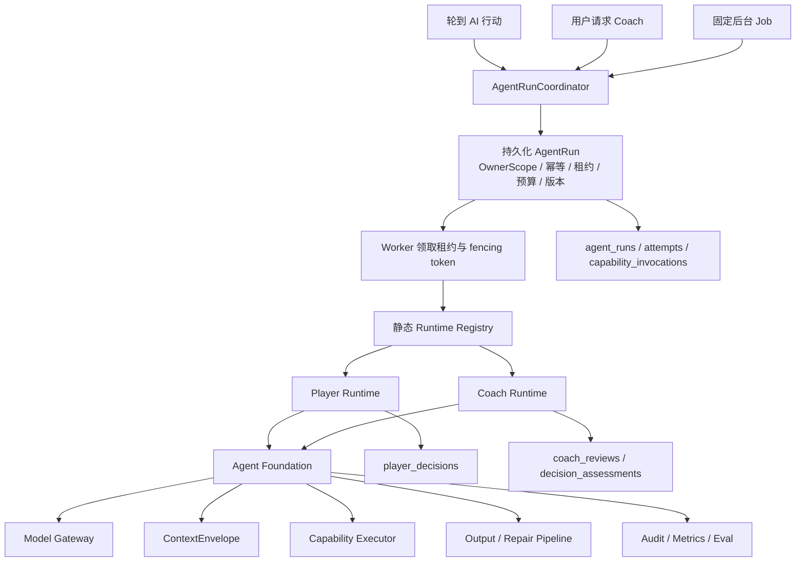
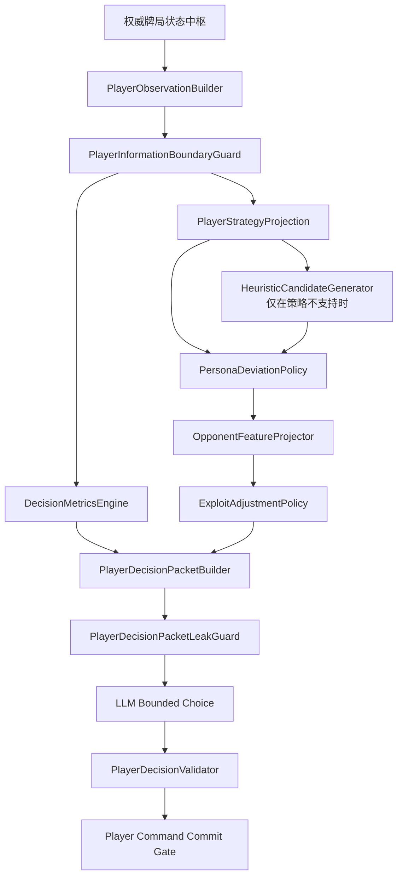
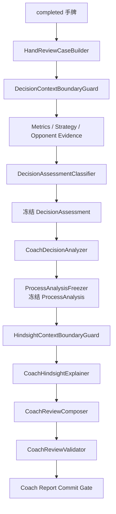

# Agent Foundation 与受限 Runtime 总体架构

- 状态：已确认
- 日期：2026-07-26
- 上位文档：[产品需求文档](./2026-07-23-poker-practice-prd.md)
- Player 专项设计：[Player Agent Runtime](./2026-07-23-poker-practice-agent-harness-design.md)
- Coach 专项设计：[Coach Agent](./2026-07-26-poker-coach-agent-design.md)
- 后端边界：[后端、牌局引擎与数据设计](./2026-07-23-poker-practice-backend-design.md)
- 专项开发任务：[Agent 大模块开发任务](../plans/2026-07-26-agent-module-development-tasks.md)

## 1. 目标

本文定义 Player Agent 与 Coach Agent 共同依赖的运行基础，以及两种 Runtime 必须保持隔离的业务边界。

本项目不以“具备最多 Agent 功能”为成熟标准。成熟度由以下能力衡量：

- 目标、信息、权限和副作用边界可证明。
- 运行可恢复、可审计、可限额。
- 模型不负责不擅长的数学、范围查询和样本判断。
- Prompt、模型、策略数据和分类规则升级可回归。
- 本地实现不提前引入分布式基础设施，但保留未来多租户上线所需的窄适配边界。

采用的路线是：

> 共享 Agent Foundation + 静态 Runtime Registry + Player/Coach 两种受限 Runtime。

Foundation 只提供通用运行机制，不理解扑克目标。Runtime 拥有完整业务状态机、私有上下文、能力清单、预算、路由、校验和 Commit Gate。

Player 与 Coach 都服务于本项目的 6–9 人无限注德州扑克规则。翻前策略按 `tableSize + logicalPosition + actionNode` 建立更陡的位置梯度；翻后计算与匹配代码在 6–9 人间复用，但仍携带翻前范围、位置、行动线和实际入池人数，不能假设结果必然相同。

## 2. 能力取舍

| 通用 Agent 能力 | 本项目决策 |
| --- | --- |
| Agent Loop | 不提供通用自主循环；Player 和 Coach 使用各自的确定性状态机 |
| Tool System | Foundation 提供能力注册、授权、Schema、超时和审计；调用计划由 Runtime 固定 |
| Context Engineering | Runtime 私有 Builder 负责数据和白名单；Foundation 只机械处理已构建的 `ContextEnvelope` |
| Memory | 使用强类型、明确作用域的 Runtime 存储，不建立统一自动召回层 |
| RAG | 当前无需求，不实现向量数据库或非结构化召回 |
| Skills | 使用静态、版本化 `PromptModule`，不使用动态 Skill 安装 |
| Plugins | 不实现运行时插件；供应商和数据源通过代码发布的内部适配器扩展 |
| Channel | 使用类型化事件和结果端口，不提供 Agent 自由消息总线 |
| 权限 | `OwnerScope` 数据权限 + `CapabilityManifest` Agent 能力权限，默认拒绝 |
| Cron | Agent 不拥有 Cron；只提供受控异步 Job，未来 Scheduler 也只能创建固定 Job |
| Multi-Agent | 多个隔离 Agent 实例由确定性编排器唤醒，不允许互相通信、委派或协商 |

当前实现明确不包含：

- 动态 Runtime、Skill 或 Plugin SDK。
- 通用 RAG、长期用户画像和情绪识别。
- Agent 自主 Cron。
- Agent 间消息、委派和协作式 Multi-Agent。
- 用户可覆盖协议的自由 Prompt。
- Redis、云消息队列、PostgreSQL、真实认证和 OpenTelemetry 平台。

## 3. 总体架构



依赖方向：

- Foundation 不依赖 Player、Coach、牌局引擎、策略数据或数据库业务模型。
- Player 和 Coach 依赖 Foundation 端口，Foundation 不能反向控制 Runtime。
- API、Session Coordinator 和 Worker 只调用 Runtime 应用入口，不直接拼 Prompt。
- Player 与 Coach 不共享 Context Schema、Prompt、记忆、业务 Validator 或 Commit Gate。
- 策略事实源可以共享，Player 与 Coach 使用不同投影。

## 4. Agent Foundation

### 4.1 `RuntimeRegistry`

首版只静态注册 `player` 与 `coach`。

每个 `RuntimeDefinition` 必须声明：

```text
runtimeType
runtimeDefinitionVersion
contextSchemaVersion
promptModuleVersions
capabilityManifest
executionBudget
routePolicy
outputSchema
validator
commitGate
recoveryPolicy
```

新增 Runtime 必须经过代码发布、数据库迁移和 Eval，不支持运行时安装。

### 4.2 `AgentRunCoordinator`

职责：

- 依据触发请求和幂等键创建 `AgentRun`。
- 验证 `OwnerScope` 与 Runtime 是否允许创建。
- 固化 Runtime、Prompt、路由、能力、预算和数据依赖版本。
- 管理运行状态、租约、取消、恢复和最终分类。
- 把运行交给 Worker，不直接执行扑克业务。

### 4.3 Worker 与租约

当前使用进程内 Worker，但任务先持久化后领取：

```text
queued → leased → running → completed | failed | cancelled | stale
```

- Worker 领取时获得过期时间和单调递增的 fencing token。
- 旧租约的迟到响应不能写入检查点或通过 Commit Gate。
- Player 与 Coach 使用独立持久化队列和并发配额。首版在同一 Node.js 进程中分别保留一个 Player Worker 槽位和一个 Coach Worker 槽位，Coach 不能占用 Player 槽位。
- 服务重启后的处理由 Runtime Recovery Policy 决定：Coach 等允许恢复的运行可以在版本检查后重新领取；`thinking` Player 必须取消旧运行并创建新运行，不能在原 AgentRun 上续跑。
- 未来消息队列只通知 Worker 存在待执行任务；数据库中的 `AgentRun` 仍是权威事实。

### 4.4 `ContextEnvelope`

Foundation 只接收 Runtime 已经完成权限过滤的 `ContextEnvelope`，负责：

- 严格 Schema 复验。
- 分区顺序、大小和 Token 预算。
- 序列化、内容哈希和版本记录。
- 通用敏感字段扫描与脱敏。

Foundation 不得：

- 查询数据库或 Repository。
- 发现、追加或推断上下文。
- 导入扑克私有状态类型。
- 把一种 Runtime 的 Context 转为另一种。

### 4.5 `CapabilityExecutor`

Foundation 提供：

- 能力名称和版本注册。
- 输入输出 Schema 校验。
- `CapabilityManifest` 授权。
- 超时、取消、预算和调用次数限制。
- 输入输出哈希、耗时和稳定错误分类。

模型不能控制调用计划：

- Player 模型工具集合为空。
- Player Runtime 的数学和策略预处理由固定状态机调用内部领域服务。
- Coach 的 Metrics、Baseline 和 Evidence 能力由 `ReviewOrchestrator` 固定调用。

### 4.6 `ModelGateway`

- 提供统一供应商适配器和错误分类。
- Player 与 Coach 使用独立、版本化的 Route Policy。
- 供应商选择不得改变 Context、权限或输出 Schema。
- API Key 只来自运行环境，不能进入请求正文、数据库、日志或前端。

### 4.7 输出、纠错与 Commit Gate

- Foundation 负责结构化输出解析和通用 Schema 纠错。
- Runtime 负责业务语义校验。
- 所有副作用必须通过 Runtime 专属 Commit Gate。
- Foundation 不提供“工具成功即自动提交”的通用能力。

Player Commit Gate 只允许合法、未过期的候选扑克决策进入标准命令事务，并在同一事务验证场次存在、OwnerScope、`active` 生命周期、有效请求标识、行动者、租约和 fencing。Coach Commit Gate 只允许通过事实校验的报告写入 Coach Repository，并验证场次存在、OwnerScope、目标手牌正常完成且未进入删除流程；Coach 不要求所属场次仍为 `active`。

删除或清空后的场次/运行不存在时，两种 Commit Gate 都必须无副作用拒绝。失败结果不能写入业务表、快照或 `session_events`，也不能触发替代运行。fencing token 只解决旧租约问题，不能代替场次存在性、OwnerScope 和删除屏障。

### 4.8 类型化 Channel

Foundation 只提供两类端口：

- `AgentRunEventPort`：发布 queued、leased、running、completed、failed、cancelled 和 stale 等已持久化运行事件。
- `RuntimeResultPort`：把 Player 候选决策结果或 Coach 报告结果返回确定性调用方。

事件必须先落数据库再发布。只有与活动扑克决策关联的 Player 协调事件可以由会话服务投影到 `session_events` 和扑克 SSE `eventSeq`；Coach 运行事件保留在独立复盘生命周期，通过查询接口读取，不占用扑克序号。若未来需要可靠跨进程投递，可增加 Outbox 适配器。Agent 不能订阅任意 Topic、向其他 Agent 发消息或把 Channel 当作协商机制。

### 4.9 静态 Prompt Module

- Prompt 由代码发布的版本化 `PromptModule` 组成。
- Runtime 固定模块顺序、变量 Schema 和最大长度。
- 用户只能选择结构化教学偏好或产品设置，不能写入 system/persona Prompt。
- 外部 Hand History 若未来支持，必须先经过确定性解析和事实校验，不能作为高优先级自由文本注入。
- Prompt 版本随 AgentRun 固化并进入 Eval；不提供动态 Skill 安装或 Plugin Prompt 注入。

## 5. 权限与多租户边界

权限分成两轴：

### 5.1 `OwnerScope`

- 场次、手牌、AgentRun、Player 决策、Coach 报告和统计都属于一个 `ownerId`。
- API、应用服务、Repository、Worker、查询和删除必须携带 `OwnerScope`。
- 本地版使用固定 `local-user` 身份适配器。
- 未来真实认证只替换身份适配器，不改变 Runtime。
- 不依赖仅在 HTTP 路由做所有权检查。

### 5.2 `CapabilityManifest`

- 默认拒绝未声明能力。
- Player 可以读取本座位安全观察、执行固定预处理并产生候选扑克决策。
- Player 不能读取其他未公开底牌、Coach 事后事实或用户画像。
- Coach 可以读取 `completed` 手牌的受控复盘投影、执行固定只读能力并保存报告；`aborted` 手牌拒绝。
- Coach 不能提交扑克动作、修改牌局状态或写入 Player 记忆。
- Foundation 只能按 Runtime 清单执行能力。

## 6. Player Runtime

### 6.1 固定流水线



### 6.2 预处理职责

`DecisionMetricsEngine`：

- 计算有效筹码 BB、底池赔率、翻后 SPR、下注比例和合法金额边界。
- 翻前不计算 SPR。
- 不输出建议动作。

`PlayerStrategyProjection`：

- 查询版本化策略事实源。
- 返回 `exact | referenceOnly | unsupported`。
- 固化数据集、版本、假设和动作分布。

`HeuristicCandidateGenerator`：

- 只在策略不支持时运行。
- 明确标记为 `heuristic`，不能冒充 GTO。
- 输出受限候选集合、风险等级、尺度边界、理由和置信度。
- 不直接抽样最终行动。

`PersonaDeviationPolicy`：

- 不使用全局“范围乘数”机械扩张所有场景。
- 基于当前节点对候选权重做有上限的确定性偏离。
- 输出基准权重、人物调整后权重、原因和尺度边界。

`OpponentFeatureProjector` 与 `ExploitAdjustmentPolicy`：

- 只使用当前决策前已经公开的数据。
- 每项证据包含分子、分母、过滤条件、`asOfEventSeq` 和置信度。
- 只有达到样本门槛才调整候选权重，调整幅度有上限。

### 6.3 `PlayerDecisionPacket`

模型接收的是决策包，不是未经加工的私有牌局状态：

```text
PlayerDecisionPacket
├── packetSchemaVersion
├── stateVersion
├── decisionRequestId
├── visibleObservation
├── deterministicMetrics
├── strategyMatch
├── candidateActions[]
│   ├── action
│   ├── targetBounds
│   ├── baseWeight
│   ├── personaAdjustedWeight
│   ├── exploitAdjustedWeight
│   ├── confidence
│   └── evidenceRefs
├── personaSummary
└── executionConstraints
```

LLM 只能在 `candidateActions` 中选择，不得重新计算数学、引入新动作或越过尺度边界。

### 6.4 信息防火墙

Player 使用三道运行时边界：

1. `PlayerInformationBoundaryGuard`：校验座位、所有者、行动者和严格公开观察 Schema。
2. `PlayerDecisionPacketLeakGuard`：校验所有事实来源、截止时间、禁止字段和未知字段。
3. Model Adapter Boundary Guard：发送前执行最终 Schema、预算和敏感信息扫描。

下游只能接收 `PlayerVisibleState`，不能接收或类型断言为完整 `PrivatePokerState`。

### 6.5 stale 与接替

租约过期本身不把运行标记为 stale：在同一服务进程生命周期内，新 Worker 可以领取同一 AgentRun 的新租约和 fencing token，但必须先重新读取权威状态。只有权威 `stateVersion`、行动者或有效请求已经不再匹配原决策点，或 Commit Gate 发现该决策点已经失效时，旧运行才标记为 stale。该规则不适用于服务进程重启。

进程重启是 Player 的独立恢复分支，不使用上述同运行续租：恢复协调器把原 `thinking` Player AgentRun 标记为 `cancelled(process_restart)`，使旧请求、attempts、租约和 fencing 失效；权威状态仍为 `active + inHand`、仍轮到同一 AI 且无其他有效运行时，新建带 `supersedesRunId` 的 AgentRun 和 `decisionRequestId`，从 DeepSeek 首次尝试开始。新运行沿用本场固化版本，但不继承旧供应商位置、纠错次数、模型输出或检查点。原来已经 `paused` 的决策保持暂停。

stale 后：

1. 旧 `AgentRun` 标记 `stale`。
2. `SessionAgentCoordinator` 读取最新权威状态。
3. 当前状态不再需要 AI 行动时，不创建旧行动替代任务。
4. 当前状态仍需要 AI 行动且不存在有效运行时，创建新 `AgentRun`，记录 `supersedesRunId`。
5. 新运行从当前权威状态重建决策包。

当前状态等待 AI 时保持 `thinking`；新运行最终失败时进入 `paused`。不实现超时自动 fold。

## 7. Coach Runtime

### 7.1 固定流水线



### 7.2 信息阶段

- Decision 阶段只接收用户当时可见信息和确定性证据。
- Hindsight 阶段只接收冻结的 ProcessAnalysis 和最小必要事后事实。
- 两个阶段使用不同 Context Schema、Builder 和 Boundary Guard。
- 两个阶段在模型发送前都经过 Adapter Boundary Guard。
- Hindsight 不能覆盖 ProcessAnalysis。

### 7.3 `DecisionAssessmentClassifier`

分类器位于 Analyzer 之前，由确定性规则实现：

```text
DecisionAssessment
├── assessment: sound | questionable | likelyMistake | unrated
├── decisionTags[]
├── severity: low | medium | high | unavailable
├── baselineComparison
├── evLoss
│   ├── status: exact | estimated | unavailable
│   ├── valueBb
│   ├── method
│   ├── sourceVersion
│   └── assumptions[]
├── evidenceRefs[]
└── classifierVersion
```

- LLM 不能新增标签、修改严重度或估算 EV。
- 没有 Solver/EV 数据时必须返回 `unavailable`。
- 决策标签只描述该次决策，不自动形成长期用户画像。
- `CoachDecisionAnalyzer` 只解释冻结判断。

### 7.4 检查点与策略版本

可复用检查点必须与该运行固定的以下版本完全一致：

- Runtime、Context 和 Prompt 模块版本。
- 策略数据集标识与版本。
- 分类器版本。
- Metric/Evidence Schema 版本和 `asOfEventSeq`。

运行中策略数据升级时，旧运行继续使用已固定版本。用户需要新教学标准时创建新的 `coachReviewId + AgentRun`。旧版本被安全撤销或损坏时，旧运行明确失败，不能混用版本。

## 8. 共享策略事实源

`StrategyDatasetRepository` 保存：

- 数据集标识、版本、来源和授权。
- 6–9 人桌型、规则、筹码深度、逻辑位置、行动线和覆盖清单。
- 翻前键至少包含 `tableSize + logicalPosition + actionNode + handClass`，不跨桌型复用同名位置。
- 动作执行频率与下注尺度的独立字段。
- 构建、压缩和验证方法。

任何百分比字段都必须明确语义：`actionFrequency=0.75` 表示 75% 执行频率，`betSizePotRatio=0.75` 表示下注尺度为 75% 底池，禁止保存或展示没有限定词的“下注 75%”。

Player 使用低延迟 `PlayerStrategyProjection`；Coach 使用包含来源、假设和教学说明的 `CoachBaselineProjection`。

Player 的 heuristic 规则不属于策略事实源，Coach 不能把它称为 GTO 或精确基准。

## 9. 数据模型

### 9.1 通用执行表

`agent_runs`：

- `ownerId`、Runtime、触发、幂等键和父/替代运行关联。
- 生命周期、租约、fencing token 和检查点。
- 固化的 Runtime、Prompt、能力、预算、路由和数据版本。
- 最终结果分类和时间。

`agent_attempts`：

- 运行阶段、供应商、模型、尝试类型和路由原因。
- 脱敏输入输出、校验错误、Token、成本和延迟。
- 是否被采用、过期或中断。

`agent_capability_invocations`：

- 能力名称与版本。
- 授权结果。
- 输入输出 Schema 版本和哈希。
- 耗时、错误和预算消耗。

### 9.2 Runtime 业务表

`player_decisions`：

- `agentRunId`、场次、手牌、座位和状态版本。
- 决策包版本和候选集合快照。
- 模型选择、Validator 结果和扑克命令关联。

`coach_reviews`：

- `agentRunId`、`coachReviewId`、手牌和复盘生命周期。
- Context、策略、分类器和证据版本。
- 冻结 ProcessAnalysis、Hindsight 和最终报告。

`coach_decision_assessments`：

- 每个 Hero 决策一条。
- 业务唯一约束为 `UNIQUE (coachReviewId, decisionId)`。
- `decisionId` 由 `handId + street + authoritativeSequence` 稳定组成。
- 同街多轮决策具有不同序号。
- 每次重新复盘创建新的 `coachReviewId`，历史 assessments 永不覆盖。

建议索引：

```text
UNIQUE (coachReviewId, decisionId)
INDEX  (coachReviewId, street, ordinalOnStreet)
INDEX  (decisionId)
```

## 10. 版本、重放与保留

- 玩家场次创建时固化人物、Runtime、Prompt、路由和能力版本。
- Coach 每次新复盘固化当时版本。
- 安全策略可以阻止危险旧版本继续运行，但不能静默改变其行为。
- 审计重放只读取历史事实，不调用模型。
- 重新执行创建新 `AgentRun`；Coach 重新生成同时创建新 `coachReviewId`。
- 原始模型输入输出使用有限、版本化保留策略。
- 业务事实、运行元数据和原始调用内容使用不同保留周期。
- 删除用户或场次时级联删除 AgentRun、尝试、能力调用和 Runtime 业务数据。
- 删除事务先取消在途运行并使租约、有效请求和 fencing 失效；迟到提交还必须复验场次存在性和 Runtime 专属生命周期，不得在删除后重建替代运行。
- Eval 夹具使用人工或去标识数据，不默认复制真实用户牌局。

## 11. 预算、可观测性与 Eval

### 11.1 `ExecutionBudget`

每种 Runtime 独立限制：

- 最大模型尝试次数。
- 输入与输出 Token。
- 单次和整次运行时限。
- 每用户与系统并发数。
- 能力调用次数。
- Coach 单次复盘成本。

预算由服务端固化，模型不能修改。超限返回稳定错误。

首版 Player 固定以下调度保证：

- 独立保留一个 Worker 槽位，不与 Coach 共享容量。
- 单次供应商尝试默认 15 秒，合法范围 5–30 秒。
- 完整决策 deadline 默认 45 秒，合法范围 15–120 秒且不得小于单次超时。
- 初始请求、纠错和降级共享剩余总时间；实际尝试超时取单次上限与剩余时间的较小值，剩余不足 5 秒时不再启动尝试并返回 `player_deadline_exhausted`。

Coach 使用自己的并发、时限与成本预算；Coach 排队或运行不能阻塞 Player 领取。

### 11.2 可观测性

指标至少包括：

- 运行数、成功率、延迟、Token 和成本。
- 降级率、纠错率、能力调用和信息边界拒绝。
- 队列等待、租约超时和 stale。

Trace 不记录底牌、Prompt 原文、API Key 或用户敏感数据。本地版实现结构化日志和测试指标端口；未来上线接 OpenTelemetry。

### 11.3 Agent Eval

确定性测试：

- OwnerScope、Capability、预算、租约、幂等、状态机和 Commit Gate。
- Context 信息隔离、工具顺序和严格 Schema。

Player 固定场景：

- 数学正确、策略匹配和 heuristic 降级。
- 人物偏离、对手调整、候选边界和动作合法率。
- 隐藏牌、未来牌和跨 Agent 记忆不泄漏。

Coach 固定场景：

- 标签、严重度、EV 可用性和基准比较。
- 两阶段隔离、冻结数据和事实引用。
- 策略版本升级与检查点恢复。

真实模型 Eval 不作为普通 CI 前置，但 Runtime、Prompt、模型、分类器或策略数据发布前必须运行版本化回归对比。

## 12. 当前与未来实现边界

当前实现：

- Agent Foundation、静态 Registry、OwnerScope 和 Capability 权限。
- SQLite 通用运行与业务表。
- 持久化 AgentRun、租约和进程内 Worker。
- Player 与 Coach 两种 Runtime。
- 版本化审计、保留策略、结构化日志、测试指标和 Eval。

未来适配：

- 真实注册与认证。
- PostgreSQL Repository。
- 消息队列和独立 Worker 集群。
- OpenTelemetry、监控与告警。

未来适配不授权动态 Plugin、RAG、Agent Cron 或协作式 Multi-Agent；这些能力如有需求必须重新设计并审批。

## 13. 代码落点

```text
apps/server/src/
├── poker/
│   ├── state.ts
│   ├── commands.ts
│   ├── engine/
│   └── rules/
├── sessions/
│   ├── authoritative-state/
│   │   ├── service.ts
│   │   ├── repository-port.ts
│   │   └── projections/
│   └── coordinator/
├── poker-strategy/
│   ├── dataset-repository/
│   ├── dataset-validation/
│   ├── player-projection/
│   └── coach-projection/
└── agents/
    ├── foundation/
    ├── player/
    │   ├── observation/
    │   ├── information-boundary/
    │   ├── decision-preprocessing/
    │   ├── decision-packet/
    │   ├── bounded-choice/
    │   ├── validator/
    │   ├── commit-gate/
    │   └── runtime/
    └── coach/
        ├── review-case/
        ├── information-boundary/
        ├── evidence-orchestrator/
        ├── assessment-classifier/
        ├── decision-analyzer/
        ├── process-analysis-freezer/
        ├── hindsight-explainer/
        ├── review-composer/
        ├── validator/
        ├── commit-gate/
        └── runtime/
```

`sessions/authoritative-state` 是牌局状态中枢：它读取和提交持久化权威状态并生成安全投影，不建立内存中的第二事实源。

## 14. 总体验收

1. Player 与 Coach 通过静态 Registry 运行，不能动态增加能力。
2. Foundation 不导入扑克私有状态或主动查询业务上下文。
3. 每次运行都有 OwnerScope、版本、预算、租约、审计和稳定最终状态。
4. Player 模型只接收经过计算、策略加工和三道防火墙的决策包。
5. Player 策略未覆盖时只使用明确 heuristic 候选，不让模型自由扩展动作。
6. Coach 的 DecisionAssessment 由确定性分类器生成并在 LLM 解释前冻结。
7. Coach Hindsight 不能覆盖标签、严重度、EV 或过程分析。
8. `coachReviewId + decisionId` 唯一标识单份复盘中的一个决策评价。
9. Worker 崩溃、租约过期、迟到响应和 stale 都不会重复提交动作或报告。
10. Player stale 后由 Session Coordinator 根据当前权威状态决定是否创建替代运行；进程重启则取消旧 Player 运行并从 DeepSeek 创建新运行。
11. Coach 检查点只在固定版本完全匹配时复用。
12. 动作执行频率与下注尺度始终使用不同字段。
13. 隐藏牌、未来牌、其他用户数据和 API Key 泄漏测试通过。
14. 本地实现不依赖真实认证、PostgreSQL、消息队列或监控平台。
15. Player 与 Coach 有独立容量，Player 全部供应商尝试共享一个总 deadline。
16. 删除/清空后的迟到结果在 Runtime 专属 Commit Gate 被拒绝，且不能创建替代运行。
