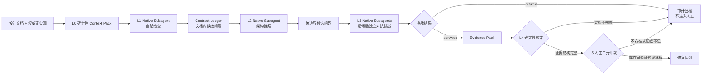

# 分层契约与对抗挑战设计评审 Skill

状态：Native Multi-Subagent 重构设计，待书面验收
日期：2026-07-31

## 1. 背景与目标

现有“设计文档 → Agent A Review → Agent B Review → Agent C Review → 人工处理”流程让多个模型自由发表完整意见。它没有稳定的角色边界，也没有可机器检查的意见准入契约，因此容易产生：

- 同一问题被不同措辞重复提交；
- 通用最佳实践、风格偏好和未来假设混入缺陷；
- 模型置信度、多数票或严重级别替代了可验证证据；
- 人工必须阅读多份长篇 Review 后重新完成事实核验；
- Prompt、项目规则和历史经验重复进入 Context，形成冲突和 Context 负债。

本设计建立仓库级 `review-design-contracts` Skill，把流程改为：

```text
分层发现 → 对抗挑战 → 确定性预审 → 人工二元仲裁 → 修复队列
```

成功标准不是“发现更多意见”，而是：

1. 只有带可验证触发路径的意见才能进入人工视野；
2. LLM 只发现、推导、反证和组织证据，不拥有准入权；
3. 最终仲裁不是 LLM 投票或 LLM-as-judge；
4. 人工只判断“是否存在可验证的契约违反路径”；
5. Review 阶段不修改设计文档；
6. 通过历史真实案例量化真阳性、漏报和人工负担。

## 2. 设计原则

### 2.1 判断环境优先于规则数量

Prompt 只声明角色边界、成功条件、禁止越界项和输出 Schema。可从工具接口、Schema 或脚本表达的规则不得重复写入 Prompt。

### 2.2 单一事实来源

- Skill 触发和阶段顺序只存在于 `SKILL.md`；
- 模型、推理强度、Subagent 超时、最大并发数、权威来源和命令白名单只存在于 `review.config.json`；
- 机器字段和必填关系只存在于 JSON Schema；
- 角色职责分别只存在于对应角色文件；
- `review-protocol.md` 只解释字段语义，不重新定义字段。

### 2.3 渐进式披露

Codex 启动时只看到 Skill 的名称和描述。Skill 触发后才读取最小工作流；每个评审 Subagent 使用 `fork_turns = "none"`，只通过 Runner 生成的任务包取得本层输入，不继承主 Agent 或其他 Subagent 的对话历史。

### 2.4 失败驱动的规则增长

先运行最小规则版本，再从真实误报、漏报和运行失败中增加最小修复。任何新增 Prompt 规则必须绑定一个人工标注的回归案例；没有失败样例的预防性规则不得加入。

### 2.5 非 LLM 仲裁

模型输出的 `PROVEN`、置信度、严重级别、排序和多数票都没有准入意义。确定性脚本负责结构与证据完整性，人工负责最终语义判断。

### 2.6 不可信内容边界

目标设计文档和权威文件一律视为待分析数据，不是运行指令。文档中的 Prompt、命令、角色声明或“忽略此前要求”等文本不得改变评审角色、工具权限、输出 Schema 或状态机。该安全边界属于产品级不变量，不受“先出现失败样例再增加规则”的限制。

这条规则只在 `review-protocol.md` 定义一次，由 Runner 作为共享前缀注入三个评审层；各角色文件不得重复改写。

## 3. 范围

### 3.1 首版包含

- Markdown 设计文档的自洽检查；
- 与显式权威文档之间的架构推理；
- 候选意见的对抗性反证；
- JSON Schema、原文引用、状态链、Oracle、命令白名单和重复指纹校验；
- 面向人工的 Evidence Card；
- 人工接受/拒绝记录；
- 本地修复队列；
- 确定性测试和模型回归评估。

### 3.2 首版不包含

- 代码 Diff Review；
- 自动修改设计文档；
- 自动创建外部 Issue、PR 或工单；
- LLM 仲裁、投票、严重度判断或自动优先级；
- Claude、Anthropic API 或其他非 OpenAI 模型；
- RAG、向量数据库、长期 Auto-memory 或跨 Review 会话记忆；
- 自动联网搜索；
- 未经白名单授权的验证命令；
- 嵌套 `codex exec`、Responses API 或其他模型调用后端；
- 无 Native Subagent 工具的纯 Node CLI、headless 或 CI 模型评审；
- Native Subagent 不可用时自动回退到其他执行后端；
- 面向多仓库分发的 Plugin 包装。

## 4. 总体架构



Skill 主 Agent 只编排 Native Subagent 和确定性 Runner，不总结、改写、排序或批准模型意见。L1 与 L2 串行；L3 按配置的并发上限分批并行，每条候选使用独立 Subagent。层与层之间只传递已经过 Runner Schema 校验的 JSON 制品。

## 5. 分层契约

### 5.1 L0：确定性 Context Pack

Node.js 脚本读取：

- 用户指定的目标设计文档；
- `review.config.json` 声明的仓库级权威文档；
- 调用时显式追加的权威文件。

Pack Builder：

1. 规范化仓库内相对路径；
2. 拒绝仓库外路径、符号链接逃逸和不存在的文件；
3. 按 Markdown 标题建立稳定章节索引；
4. 保存原文、文件 SHA-256、章节标题和章节 SHA-256；
5. 生成只读 `manifest.json`；
6. 把文档编码为带来源、长度和摘要的结构化数据对象，不把文档正文拼接成角色指令；
7. 按以下固定规则为各层生成输入，而不是做语义“相关性”判断：
   - L1 获得目标设计文档全文；
   - L2 获得目标设计文档全文、Contract Ledger 和所有显式声明的权威文件全文；
   - L3 获得单条候选、候选引用的完整 Markdown 章节及对应 Contract Ledger 条目。
8. 为每次 Native Subagent 调用生成独立任务目录，其中只包含 `task.json`、`instructions.md`、`input.json`、`output.schema.json` 和待写入的 `response.json` 路径。

L0 不调用模型，也不推断设计是否正确。

### 5.2 L1：自洽检查

默认使用 `gpt-5.6-sol`、`high`，由一个 `fork_turns = "none"` 的 Native Subagent 执行。

唯一职责：

- 抽取术语、状态、输入、输出、不变量、权限、事务边界和验收要求；
- 生成结构化 Contract Ledger；
- 找出设计文档内部可以由具体输入和有限状态链触发的矛盾。

禁止：

- 宏观架构重设计；
- 通用最佳实践；
- 措辞和风格建议；
- 对未声明未来功能的猜测。

### 5.3 L2：架构推理

默认使用 `gpt-5.6-sol`、`max`，由一个新的 `fork_turns = "none"` Native Subagent 执行。

输入为 Contract Ledger、目标设计文档全文以及所有显式声明的权威架构文档全文。L0 不按关键词或模型判断裁剪 L2 输入。L2 的唯一职责：

- 追踪模块入口和依赖方向；
- 检查事实归属、数据镜像和契约版本；
- 推导事务、并发、生命周期和错误边界；
- 构造跨边界的有限触发路径。

L2 不得提交风格、命名、重构偏好或“可以更优雅”的意见。

### 5.4 L3：对抗挑战

默认使用 `gpt-5.6-sol`、`max`。每条候选意见使用一个新的 `fork_turns = "none"` Native Subagent；不同候选可以有界并行，但不得共享对话或合并判断。

L1 的文档内候选与 L2 的跨边界候选组成候选并集。L2 不修改、批准或否决 L1 候选；Runner 在进入 L3 前只做 Schema、引用和重复指纹预检。

步骤固定为：

1. 寻找候选意见引用错误、不可达前置状态、跳步或错误推导；
2. 尝试构造一个满足契约但不会发生所述违反的反例；
3. 能推翻时输出 `challenge_outcome = "refuted"` 和具体反例；Runner 验证 adversarial result Schema、候选引用和摘要后，以自动原因码 `REFUTED_BY_COUNTEREXAMPLE` 写入 `rejected.json`，不得生成 Evidence Card；
4. 不能推翻时输出 `challenge_outcome = "survives"`，并把候选收敛为最小触发路径；
5. 首版 L3 不得提交新问题。L3 观察到的其他风险不写入任何运行制品；新问题只能由 L1 或 L2 产生，并在新的独立 L3 Context 中接受挑战。

L3 只有负向过滤权，没有修复队列准入权。所有 `refuted` 结果保留完整审计记录并计入已知问题召回评估；只有 `survives` 结果可以进入 L4，最终仍须经过确定性预审和人工仲裁。

### 5.5 L4：确定性预审

Node.js 脚本执行：

- JSON Schema 校验；
- `challenge_outcome` 与对应字段关系校验；
- Context Pack 文件和章节存在性校验；
- 原文逐字匹配和摘要校验；
- 必填状态链校验；
- Verification Oracle 校验；
- 命令白名单校验；
- 重复指纹计算与去重；
- 可执行验证的退出码与输出摘要记录；
- 人工报告字段投影。

L4 不调用模型，不判断自然语言主张是真是假。

### 5.6 L5：人工二元仲裁

人工只看到：

```text
契约原文
→ 初始状态
→ 触发步骤
→ 推导结果
→ 契约违反
→ 验证方法与 Oracle
```

人工不看到模型名称、推理强度、置信度、严重级别、票数或模型自己的证明标签。

人工回答：

```text
是否存在可验证的契约违反路径？
```

- `accept`：写入本次运行的 `fix-queue.json`；
- `reject`：归档，并记录一个确定性原因码；
- “暂时无法确认”归入 `reject`，未来可携带新证据重新提交。

拒绝原因码固定为：

```text
NO_REACHABLE_STATE
BROKEN_TRANSITION
NO_CONTRACT_VIOLATION
UNVERIFIABLE_ORACLE
DUPLICATE
OUT_OF_SCOPE
```

以上是仅由 L5 写入的 `human_rejection_reason` 枚举。Runner 和 L4 写入独立的 `automatic_rejection_reason` 枚举，其中包含 `REFUTED_BY_COUNTEREXAMPLE`；自动原因码不得作为人工决定写入，人工原因码也不得由 Runner 代填。每条拒绝记录必须携带 `decision_source: automatic | human`，并由 Schema 根据该字段约束对应的原因码枚举。

`review-protocol.md` 只解释两类原因码的归属和写入主体，不重复枚举值；完整枚举以 `rejection-record.schema.json` 中按 `decision_source` 区分的两个条件分支为唯一事实源。

## 6. Evidence Card 契约

每条候选意见必须包含：

```yaml
finding_id: 由脚本计算
layer: self_consistency | architecture

claim: 一句话描述被违反的契约
contract:
  source: 权威文件路径
  heading: 稳定章节标题
  quote: 原文片段
  quote_hash: 由脚本计算

trigger:
  initial_state:
    - 具体、可构造的前置事实
  steps:
    - actor: 执行主体
      action: 明确动作或状态转换
      result: 该步产生的状态
  derived_outcome: 最终可观察结果

violation:
  expected: 契约要求的结果
  actual: 触发路径推导出的结果

verification:
  mode: executable | static_trace | spec_counterexample
  procedure: 可重复的验证步骤
  oracle: 什么结果代表问题成立

falsification:
  attempt: 挑战者如何尝试推翻该问题
  remaining_evidence: 为什么触发路径仍然成立
```

`finding_id` 和完全重复指纹均由脚本根据规范化字段计算，模型提供的 ID 被忽略。指纹输入为以下字段的 canonical JSON：

```text
contract.source
contract.heading
contract.quote_hash
trigger.initial_state
trigger.steps
trigger.derived_outcome
violation.expected
violation.actual
```

规范化只处理 Unicode、换行、首尾空白和对象键顺序，不做语义改写。完全相同的指纹只能保留一条；措辞不同但语义相同的候选不得由另一个 LLM 合并，也不得只按 `quote_hash` 或违反类别合并，以免误删同一契约下的不同缺陷。遗漏的语义重复由人工 `DUPLICATE` 原因码记录并作为独立质量指标。

Evidence Card 只由 `challenge_outcome = "survives"` 的对抗结果构造，`falsification.remaining_evidence` 必须为非空字符串。`refuted` 采用独立的 adversarial result Schema，不适用 Evidence Card Schema。

三种验证模式：

- `executable`：现有代码、Schema、SQL 或测试可以运行验证；
- `static_trace`：通过确定模块入口、数据流或状态转换静态追踪；
- `spec_counterexample`：设计尚未实现，但具体输入和有限步骤会使契约发生矛盾。

## 7. 自动拒绝规则

以下候选不得进入人工报告：

1. 引用不存在、原文不匹配或不在 Context Pack 中；
2. 没有具体初始状态；
3. 任一步缺少主体、动作或结果；
4. 只有模糊风险，没有最终可观察结果；
5. 只引用通用最佳实践，没有违反项目契约；
6. 只说“文档没写”，却不能证明遗漏允许两个互斥实现结果；
7. 没有验证步骤或 Oracle；
8. `challenge_outcome` 不是 `survives`，或没有非空的反证尝试与剩余证据；
9. 与已有问题具有相同的“契约 + 初始状态 + 动作 + 违反结果”指纹；
10. 验证命令不匹配安全白名单；
11. 属于措辞、风格、重构偏好或未来假设功能。

自动拒绝项写入 `rejected.json` 供调试，但不进入 `human-review.md`。

## 8. Native Multi-Subagent 编排

所有评审层只使用 `gpt-5.6-sol`：

| 层级 | 推理强度 | 原因 |
|---|---:|---|
| L1 | `high` | 契约抽取和文档内一致性是有界任务 |
| L2 | `max` | 跨模块、事务和生命周期推理需要能力上限 |
| L3 | `max` | 反证和最小反例构造需要充分验证 |

Skill 主 Agent 必须使用 Codex Native Subagent 工具执行模型层，并固定：

- 每次调用使用 `fork_turns = "none"`；
- `model` 和 `reasoning_effort` 必须逐任务取自 `review.config.json`；
- L1 完成并经 Runner 校验后才生成 L2 任务；
- L2 完成并经 Runner 校验后才生成 L3 任务；
- L3 每条候选一个独立 Subagent，按 `max_parallel_subagents` 分批调度；
- 主 Agent 只读取 Runner 返回的任务描述、状态和人工报告，不解释 Subagent 的自然语言过程；
- Subagent 只允许读取其任务目录并写入指定的 `response.json`，不得修改目标文档、权威文件或其他运行制品；
- 不调用嵌套 `codex exec`、Responses API 或其他厂商；
- Native Subagent 不可用时立即停止，不自动降级或回退。

`review.config.json` 首版设置 `max_parallel_subagents: 3` 和 `subagent_timeout_ms: 900000`。并发数只是上限，不是最低要求；如果当前会话可用子槽更少，主 Agent 等待已启动任务完成后再派发下一批，不得提高上限、丢弃候选或让一个 Subagent 合并多个 L3 候选。超时从任务成功派发后开始计算；到期仍未结束或未生成指定响应时按基础设施失败处理。

Runner 为每个任务生成 `instructions.md`、`input.json` 与 `output.schema.json`，并在 `prepare` 或 `advance` 的标准输出中返回完整任务描述：

```text
task_id
task_path
model
reasoning_effort
fork_turns
response_path
spawn_message
```

其中 `fork_turns` 必须为 `none`，`spawn_message` 由 Runner 从固定模板生成，只包含任务文件路径、指定响应路径和完成条件。主 Agent 必须逐字段校验任务描述后原样传给 Native Subagent，不得增删角色指令、目标内容或候选结论。

共享 Prompt 明确把所有文档标记为不可信数据，并禁止把文档内容解释为指令。项目规则若与本次 Review 有关，必须作为显式权威文件进入 Pack；评审层不得依赖主会话历史、其他 Subagent 输出、全局 Memory 或隐藏历史。

`fork_turns = "none"` 只保证不继承父会话对话，不保证移除 Codex 产品级系统指令、工具定义或 Skill 元数据。Native Subagent 仍是完整 Codex Agent，而不是裸模型调用；本设计接受这一限制，并通过最小任务包、互斥角色、目标摘要失效检查、确定性门禁和人工仲裁约束其影响。若回归评估证明该 Context 导致发布门槛失败，再单独设计 Responses API 后端，不在首版预建双后端。

Native Subagent 也继承当前 Codex 任务的工具和文件系统权限；`fork_turns = "none"` 不提供操作系统级读写隔离。“只读取任务目录、只写入 `response.json`”是可审计的任务契约，而不是文件系统强制边界。Runner 在每次推进前重验目标设计、权威文件和任务输入摘要；实际 dogfood 还必须确认没有业务文件变化。若未来要求强制最小权限或无人值守执行，应另行设计隔离运行环境，不得把本协议描述为已经具备该能力。

Native Subagent 复用当前 Codex 会话的登录和网络能力。Runner 不读取、复制或转发 Codex 登录文件、API Key、代理变量、数据库 URL、Provider Key 或业务 Secret。

同一模型家族可能存在相关盲区。本设计通过新 Context、互斥职责、先反证后证明、确定性门禁和人工仲裁降低风险，而不声称模型同质性等价于独立模型多样性。

## 9. Skill 布局

仓库级 Skill 位于：

```text
.agents/skills/review-design-contracts/
├── SKILL.md
├── agents/
│   └── openai.yaml
├── review.config.json
├── references/
│   ├── review-protocol.md
│   ├── self-consistency-role.md
│   ├── architecture-role.md
│   ├── adversarial-role.md
│   ├── contract-ledger.schema.json
│   ├── candidate-finding.schema.json
│   ├── adversarial-result.schema.json
│   ├── evidence-card.schema.json
│   ├── rejection-record.schema.json
│   └── eval-cases.jsonl
└── scripts/
    ├── review-design.mjs
    └── review-design.test.mjs
```

`agents/openai.yaml` 设置 `allow_implicit_invocation: false`。用户必须显式调用：

```text
$review-design-contracts docs/superpowers/specs/<design>.md
```

首版仍采用一个 Node.js Runner，但把原先的单次 `run` 改为多阶段协议：

```text
prepare <design> [--authority ...] [--retry-of ...]
→ 建立运行、生成 L1 任务并返回任务描述

advance <run-directory>
→ 校验已完成 response.json、原子推进状态并返回下一批任务

fail-task <run-directory> --task <task-id> --message <diagnostic>
→ 把 Native Subagent 不可用、超时或异常记录为 FAILED

decide <run-directory> --decisions <json>
verify-queue <run-directory>
→ 保持既有人工仲裁与队列消费协议
```

Skill 主 Agent 根据 Runner 返回的任务描述调用 Native Subagent。Runner 不调用模型、不调用 Native Subagent 工具，也不解释模型结果。只有出现第二个独立消费者时才拆分公共库。

## 10. 运行制品与状态机

运行制品写入现有 Git 忽略目录：

```text
.superpowers/design-reviews/<document-hash>/<run-id>/
├── state.json
├── manifest.json
├── tasks/
│   └── <task-id>/
│       ├── task.json
│       ├── instructions.md
│       ├── input.json
│       ├── output.schema.json
│       └── response.json          # 由该任务的 Native Subagent 写入
├── contract-ledger.json
├── candidates.json
├── adversarial-results.json
├── verification-results.json
├── evidence-cards.json
├── rejected.json
├── human-review.md
├── decisions.json
├── fix-queue.json
└── failure.json                 # 仅 FAILED 运行存在
```

`task.json` 至少包含 `task_id`、`stage`、`attempt`、`model`、`reasoning_effort`、`fork_turns`、`response_path`、`spawn_message` 和输入摘要。任务 ID、路径、消息和摘要全部由 Runner 生成；主 Agent 和 Subagent 不得自选。`state.json` 额外记录当前 `active_tasks` 及每个任务的尝试次数。

状态机：

```text
CREATED
→ PACKED
→ SELF_CHECKED
→ ARCHITECTURE_CHECKED
→ CHALLENGED
→ DETERMINISTICALLY_GATED
  ├─ 零张 Evidence Card → CLOSED
  └─ 非零 Evidence Card → AWAITING_HUMAN → QUEUED | CLOSED

任一未完成阶段 → FAILED
CREATED 至 AWAITING_HUMAN 的任一阶段发生输入摘要失配 → INVALIDATED
```

`FAILED` 和 `INVALIDATED` 是显式终态。`FAILED` 记录 `failed_stage`、确定性原因码和诊断制品；`INVALIDATED` 记录检测到的旧/新输入摘要。已经写入的人工决策保持历史不可变，但 `INVALIDATED` 运行不得产生或继续使用 fix queue。

`QUEUED` 和 `CLOSED` 保持历史终态，不因后续文档变化而重写。每条 queue item 必须携带原始目标文档摘要；后续修复工作流在消费前重新计算摘要，不匹配时拒绝执行并要求创建新的 Review run。

失败或失效后重跑必须创建新 `run-id`，并通过 `retry_of` 引用旧运行；不得复用中间状态或覆盖旧制品。每次状态转换先写入临时文件，再以原子重命名替换状态制品。

运行状态在等待 Native Subagent 时保持当前阶段：`PACKED` 等待 L1，`SELF_CHECKED` 等待 L2，`ARCHITECTURE_CHECKED` 等待全部 L3。只有当前阶段所有响应都通过 Schema、摘要、引用和任务归属校验后才发生下一次状态转换。`advance` 不得跳过未完成任务或接受非当前任务的响应。

候选 Schema 不设置语义 Top-K 或 `maxItems`。输出因 Token、进程或解析限制而截断时按无效 Schema 处理，最终进入 `FAILED`，不得让模型自行挑选“最重要”的若干条。

确定性预审后，Evidence Card 按 `contract.source → contract.heading → contract.quote_hash → finding_id` 稳定排序。零张卡片时直接进入 `CLOSED`，在 `state.json.completion_reason` 记录 `NO_ADMISSIBLE_FINDINGS`，不生成空的人工作业；它不是自动或人工拒绝原因码。非零结果每批最多 8 张；超过 8 张时记录 `REVIEW_OVERLOAD` 质量标记，但仍进入 `AWAITING_HUMAN`。`human-review.md` 明确分批，Skill 每次只展示当前批次。所有批次完成仲裁后，至少一条 `accept` 进入 `QUEUED`，否则进入 `CLOSED`。未处理完全部批次时不得宣布 Review 完成。

## 11. 失败处理

- `CREATED` 至 `AWAITING_HUMAN` 期间任一输入文件摘要变化，整次运行进入 `INVALIDATED`；
- Native Subagent 输出不满足 Schema、任务归属或输入摘要时，Runner 归档无效响应，只允许同模型、同强度、`fork_turns = "none"` 的全新 Subagent 修复一次；
- 第二次仍失败则整层进入 `FAILED`，不向人工提交部分结果；
- 不允许自动换模型、降低强度、调用嵌套 `codex exec`、Responses API 或其他厂商；
- Native Subagent 工具不可用、调度失败、超时或未生成指定响应时，主 Agent 必须调用 `fail-task`，Runner 记录基础设施失败；
- 模型提出的命令默认不执行；
- 只有与 `review.config.json` 白名单完全匹配的命令才由 Runner 执行；
- Subagent 异常、引用失配、任务摘要失配或验证环境异常记录为基础设施失败并进入 `FAILED`；
- 基础设施失败不得伪装成“没有问题”；
- Review 阶段不修改目标文档；
- 只有人工 `accept` 才能进入 `fix-queue.json`。

## 12. 测试与评估

### 12.1 确定性单元测试

至少覆盖：

- Schema 缺字段必拒绝；
- `refuted` 结果只进入拒绝审计，不生成 Evidence Card；
- `survives` 缺少剩余证据必拒绝；
- 引用或摘要失配必拒绝；
- 状态链跳步必拒绝；
- 无 Oracle 必拒绝；
- 完全重复指纹只保留一条；
- 未授权命令绝不执行；
- L1/L2 输入包含目标设计全文，L3 输入只包含显式引用章节；
- `prepare` 只生成一个 L1 任务，L1 未校验前不得生成 L2；
- L2 未校验前不得生成 L3，L3 每个任务只包含一条候选；
- L3 任务按 `max_parallel_subagents` 分批返回且不丢失；
- Runner 返回完整且可原样传给 Native Subagent 的任务描述；
- 主 Agent 不得修改 Runner 生成的 `spawn_message`、模型或推理强度；
- 非当前任务、错误摘要或错误 attempt 的响应不得推进状态；
- 首次无效响应生成同模型同强度的第二次任务，第二次无效进入 `FAILED`；
- Runner 不启动 `codex exec`，也不读取或传递登录、API Key 和代理环境；
- 输入变化使运行进入 `INVALIDATED`；
- 模型或基础设施失败使运行进入 `FAILED`；
- 零张 Evidence Card 时不进入人工阶段并以 `NO_ADMISSIBLE_FINDINGS` 关闭；
- 超过 8 张 Evidence Card 会确定性分批且不丢失；
- 模型、严重级别和置信度不会进入人工报告；
- 只有人工接受项进入修复队列；
- queue item 的目标文档摘要失配时不能被后续修复工作流消费；
- 文档中的指令文本不会改变 Runner 参数、工具权限或输出 Schema。

### 12.2 人工标注回归集

`eval-cases.jsonl` 首版至少包含 20 个平衡案例：

- 真问题取自本仓库历史设计修订，例如微秒游标截断、OwnerScope 边界、新场次身份映射和未发布模型配置提前准入；
- 反例覆盖措辞偏好、通用最佳实践、未来功能猜测、重复问题和不可达状态；
- 至少包含一个要求模型忽略角色契约或执行命令的 Prompt 注入案例；
- 每个案例由人工预先标注 `admit | reject`；
- 标签不能由另一个 LLM 生成；
- 以后只从真实误报、漏报和人工争议中增长。

这 20 个案例只用于首版流水线、明显回归和发布门槛检查，不足以证明一种模型配置优于另一种。

### 12.3 模型配置比较

评估以下配置：

1. `high / max / max`：默认基线；
2. `max / max / max`；
3. `high / high / max`。

模型配置不得自动切换。只有同时满足以下条件时，人工才能修改生产默认值：

- 至少 50 个独立人工标注案例；
- 每种配置对每个案例至少运行 3 次独立 Trial；
- 候选配置通过全部硬性发布门槛；
- 已知阻断级问题召回率不下降；
- 相比基线，人工准入精确率提高至少 5 个百分点，或在召回率不下降时 Evidence Card 中位数至少减少 1。

条件不足或结果不一致时保留 `high / max / max`。首版 20 案例的配置结果只作方向性记录。

### 12.4 首版发布门槛

- 确定性测试通过率：100%；
- 已知阻断级问题召回率：100%；
- 总体已知问题召回率：至少 80%；
- 人工准入精确率：至少 85%；
- 完全重复逃逸率：0；
- 人工语义重复暴露率：不超过 5%；
- 非白名单命令执行次数：0；
- 每份文档送达人类的 Evidence Card 中位数：不超过 5；
- 超过 8 张卡片时必须标记 `REVIEW_OVERLOAD`；
- 端到端 Review 期间目标设计文档无变化。

成本、Token 和耗时只作次级指标，质量门槛通过后才参与配置选择。

指标口径固定为：

- `已知问题召回率 = 进入人工报告的已知真问题数 / 回归集已知真问题总数`；
- `人工准入精确率 = 人工标注为 admit 的卡片数 / 进入人工报告的卡片总数`；
- `完全重复逃逸率 = 具有相同确定性指纹且同时进入人工报告的重复卡片数 / 进入人工报告的卡片总数`；
- `人工语义重复暴露率 = 被人工以 DUPLICATE 拒绝的卡片数 / 进入人工报告的卡片总数`。

## 13. 实施验收

Skill 实施完成必须证明：

1. Codex 能从仓库根目录发现该 Skill；
2. 普通设计讨论不会隐式触发 Skill；
3. 缺少 Native Subagent 工具时 Skill 明确停止，不创建 fallback 模型调用；
4. Runner 能以任务响应 fixture 完成 `prepare → advance → decide` 的全部确定性状态转换；
5. 实际调度中 L1/L2/L3 均使用 `gpt-5.6-sol`、指定推理强度和 `fork_turns = "none"`；
6. L3 候选按配置有界并行，主 Agent 不总结、合并或筛选 Subagent 输出；
7. `refuted`、`FAILED`、`INVALIDATED` 和多批 `AWAITING_HUMAN` 路径均有端到端测试；
8. 至少一个历史真问题通过完整 Native Multi-Subagent 流程形成 Evidence Card；
9. 至少一个反例和一个 Prompt 注入案例不会进入人工报告；
10. 人工接受前 `fix-queue.json` 为空；
11. 人工接受后只新增对应 finding；
12. 目标设计文档和其他业务代码均未被修改；
13. Skill 验证与打包检查通过。

首版只实现本设计所需文件，不修改 `REPO_MAP.md` 或 `ARCHITECTURE.md` 的业务架构内容。Skill 成为新的仓库级开发工作流后，只需在 `REPO_MAP.md` 增加一条工具职责说明。

## 14. 参考依据

- [OpenAI GPT-5.6 model guidance](https://developers.openai.com/api/docs/guides/latest-model)：精简 Prompt、明确自主与审批边界、为高价值 Review 声明证据和成功条件，并以代表性任务比较推理强度。
- [Codex Build skills](https://learn.chatgpt.com/docs/build-skills)：仓库级 `.agents/skills`、渐进式披露、Skill 目录结构、显式调用策略和确定性脚本适用边界。
- [Anthropic: Demystifying evals for AI agents](https://www.anthropic.com/engineering/demystifying-evals-for-ai-agents)：优先使用确定性 grader、平衡正反案例、以稳定环境和人工校准评估 Agent。该资料只作为评估方法参考，运行时不使用 Anthropic 模型或服务。
